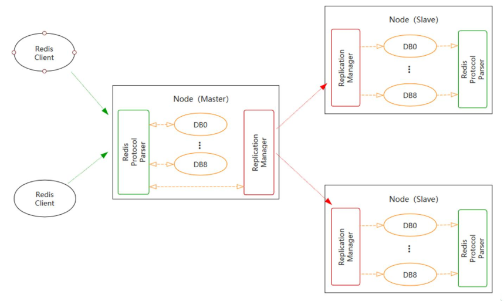
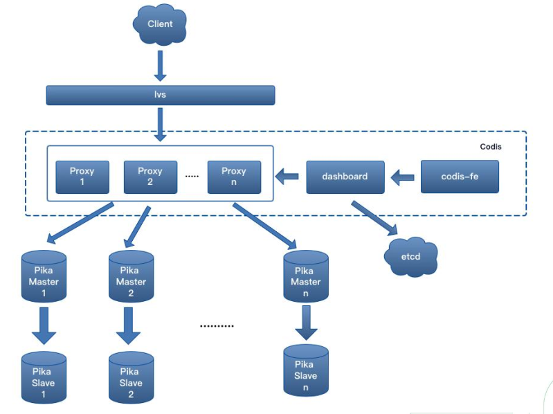

[](https://travis-ci.org/Qihoo360/pika) 

|                                             **Stargazers Over Time**                                              |                                                                                                            **Contributors Over Time**                                                                                                            |
|:-----------------------------------------------------------------------------------------------------------------:|:------------------------------------------------------------------------------------------------------------------------------------------------------------------------------------------------------------------------------------------------:|
|      [](https://starchart.cc/OpenAtomFoundation/pika)      | [](https://contributor-graph-api.apiseven.com/contributors-svg?chart=contributorOverTime&repo=OpenAtomFoundation/pika) |

## Introduction[中文](https://github.com/OpenAtomFoundation/pika/blob/unstable/README_CN.md)

Pika is a high-performance, large-capacity, multi-tenant, data-persistent elastic KV data storage system using RocksDB as the storage engine. It is fully compatible with the Redis protocol and supports its commonly used data structures, such as string/hash/list/zset/set/geo/hyperloglog/pubsub/bitmap/stream, etc. [Redis Interface](https://github.com/OpenAtomFoundation/pika/wiki/pika-%E6%94%AF%E6%8C%81%E7%9A%84redis%E6%8E%A5%E5%8F%A3%E5%8F%8A%E5%85%BC%E5%AE%B9%E6%83%85%E5%86%B5).

When Redis's in-memory usage exceeds 16GiB, it faces problems such as limited memory capacity, single-threaded blocking, long startup recovery time, high memory hardware costs, easily filled buffers, and high switching costs when one master and multiple replicas fail. The emergence of Pika is not to replace Redis but to complement it. Pika strives to completely comply with the Redis protocol, inherit Redis's convenient operation and maintenance design, and solve the bottleneck problem of Redis running out of memory capacity once the data volume becomes huge by using persistent storage. Additionally, Pika can support master-slave mode using the slaveof command, and it also supports full and incremental data synchronization.

Pika can be deployed in a single-machine master-slave mode (slaveof) or in a [Codis](https://github.com/OpenAtomFoundation/pika/tree/unstable/cluster) cluster mode, allowing for simple scaling and shrinking. Migration from Redis to Pika can be smoothly executed by [tools](https://github.com/OpenAtomFoundation/pika/tree/unstable/tools).

## Pika Features

* **Protocol Compatibility**: Fully compatible with the Redis protocol, emphasizing high performance, large capacity, low cost, and scalability.
* **Data Structures**: Supports Redis's common data structures, including String, Hash, List, Zset, Set, Geo, Hyperloglog, Pubsub, Bitmap, Stream, ACL, etc.
* **Cold and Hot Data**: Caches hot data and persistently stores the full data in RocksDB, implementing a hierarchical storage of cold and hot data.
* **High Capacity**: Compared to Redis's in-memory storage, Pika supports data volumes in the hundreds of gigabytes, significantly reducing server resource consumption and enhancing data reliability.
* **Deployment Modes**: Supports single-machine master-slave mode (slaveof) and Codis cluster mode, making scaling and shrinking simple.
* **Easy Migration**: Smooth migration from Redis to Pika without modifying code.
* **Convenient Operation and Maintenance**: Comprehensive operation and maintenance command documentation.

## Pika Storage Engine Architecture

* Supports multiple platforms: CentOS, Ubuntu, macOS
* Multi-threaded model
* Based on the RocksDB storage engine
* Multiple granularity data caching model

## Deployment Modes

### 1. Master-Slave Mode

* Architecture similar to Redis
* Good compatibility with Redis protocol and data structures
* Each data structure uses a separate RocksDB instance
* Master-slave adopts binlog asynchronous replication



### 2. Distributed Cluster Mode

* Adopts Codis architecture, supports multiple groups
* Each group forms a master-slave set
* Elastic scaling based on groups



## Pika User Showcase

<table>
<tr>
<td height = "100" width = "150"></td>
<td height = "100" width = "150"></td>
<td height = "100" width = "150"></td>
<td height = "100" width = "150"></td>
</tr>
<tr>
<td height = "100" width = "150"></td>
<td height = "100" width = "150"></td>
<td height = "100" width = "150"></td>
<td height = "100" width = "150"></td>
</tr>
<tr>
<td height = "100" width = "150"></td>
<td height = "100" width = "150"></td>
<td height = "100" width = "150"></td>
<td height = "100" width = "150"></td>
</tr>
<tr>
<td height = "100" width = "150"></td>
<td height = "100" width = "150"></td>
<td height = "100" width = "150"></td>
<td height = "100" width = "150"></td>
</tr>
<tr>
<td height = "100" width = "150"></td>
<td height = "100" width = "150"></td>
<td height = "100" width = "150"></td>
<td height = "100" width = "150"></td>
</tr>
</table>

Pika has been widely adopted by various companies for internal deployments, demonstrating its scalability and reliability. Some notable usage instances include:

* **360 Company**: Internal deployment with a scale of 10,000+ instances, each having a data volume of 1.8TB.
* **Weibo**: Internal deployment with 10,000+ instances.
* **Ximalaya(Xcache)**: 6,000+ instances with a massive data volume exceeding 120TB.
* **Getui (个推) Company**: Internal deployment involving 300+ instances, with a cumulative data volume surpassing 30TB.

Additionally, Pika is utilized by companies such as Xunlei, Xiaomi, Zhihu, New Oriental Education & Technology Group (好未来), Kuaishou, Sohu, Meituan, Maimai, and more. For a comprehensive list of users, you can refer to the official list provided by the Pika project.

These deployments across a diverse range of companies and industries underscore Pika's adaptability and effectiveness in handling large-scale, high-volume data storage requirements.

[More](docs/USERS.md)


## Getting Started with Pika

### 1. Binary Package Installation

Users can directly download the latest binary version package from [releases](https://github.com/Qihoo360/pika/releases).

### 2. Compilation from Source

* #### 2.1 Supported Platforms

  * Linux - CentOS
  * Linux - Ubuntu
  * macOS(Darwin)
  
* #### 2.2 Required Library Software

  * gcc g++ supporting C++17 (version >= 9)
  * make
  * cmake (version >= 3.18)
  * autoconf
  * tar
  
* #### 2.3 Compilation Process

  * 2.3.1. Get the source code

    ```bash
      git clone https://github.com/OpenAtomFoundation/pika.git
    ```

  * 2.3.2. Switch to the latest release version

    ```bash
      git tag          # Check the latest release tag (e.g., v3.4.1)
      git checkout TAG # Switch to the latest version (e.g., git checkout v3.4.1)
    ```
  
  * 2.3.3. Execute compilation

    > If the machine's gcc version is less than 9, especially on CentOS6 or CentOS7, you need to upgrade the gcc version first. Execute the following commands:
    >
    > ```bash
    >   sudo yum -y install centos-release-scl
    >   sudo yum -y install devtoolset-9-gcc devtoolset-9-gcc-c++
    >   scl enable devtoolset-9 bash
    > ```

    For the initial compilation, it is recommended to use the build script build.sh, which checks if the required software is available on the local machine.

    ```bash
      ./build.sh
    ```

    > Note: The compiled files will be saved in the output directory.

    Pika is compiled by default in release mode, which does not support debugging. If debugging is needed, compile in debug mode.

    ```bash
      rm -rf output/
      cmake -B output -DCMAKE_BUILD_TYPE=Debug
      cd output && make
    ```

    Other components, such as codis and pika_operator, can also be compiled using build.sh.

    ```bash
      # Compile codis, default target, build-all
      ./build.sh codis

      # Compile codis, but only build codis-proxy
      ./build.sh codis codis-proxy

      # Compile pika_operator
      ./build.sh operator
    ```

* #### 2.4 Start Pika

  ```bash
    ./output/pika -c ./conf/pika.conf
  ```

* #### 2.5 Clear Compiled Results

  If you need to clear the compilation content, you can choose one of the following methods based on the situation:

  Method 1: Clean only the current compilation content

  ```bash
    cd output && make clean
  ```

  Method 2: Completely recompile

  ```bash
    rm -rf output # regenerate cmake
  ```

* #### 2.6 Pika Development Debugging

  [Setting up Pika Development Environment with CLion](./docs/ops/SetUpDevEnvironment.md)
  
### 3. Containerization

* #### 3.1 Running with Docker

  ```bash
  docker run -d \
    --restart=always \
    -p 9221:9221 \
    -v <log_dir>:/pika/log \
    -v <db_dir>:/pika/db \
    -v <dump_dir>:/pika/dump \
    -v <dbsync_dir>:/pika/dbsync \
    pikadb/pika:v3.3.6

  redis-cli -p 9221 "info"
  ```

* #### 3.2 Build Custom Image

  If you want to build your own image, we provide a script `build_docker.sh` to simplify the process.
  
  This script accepts several optional parameters:

  * `-t tag`: Specify the Docker tag for the image. By default, the tag is pikadb/pika:<git tag>.
  * `-p platform`: Specify the platform for the Docker image. Options include all, linux/amd64, linux/arm, linux/arm64. By default, it uses the current docker platform setting.
  * `--proxy`: Use a proxy to download packages to speed up the build process. The build will use Alibaba Cloud's image source.
  * `--help`: Display help information.
  
  Here is an example usage:

  ```bash
  ./build_docker.sh -p linux/amd64 -t private_registry/pika:latest
  ```

* #### 3.3 Deployment with Pika-operator

  Using pika-operator simplifies the deployment of a single-instance pika in a Kubernetes environment.
  
  >Note: Do not use this feature in a production environment.

  Local installation:

  1. Install [MiniKube](https://minikube.sigs.k8s.io/docs/start/)

  2. Deploy Pika-operator

    ```bash
    cd tools/pika_operator
    make minikube-up # run this if you don't have a minikube cluster
    make local-deploy
    ```

  3. Create a Pika instance

    ```bash
    cd tools/pika_operator
    kubectl apply -f examples/pika-sample/
    ```

  4. Check the Pika status

    ```bash
      kubectl get pika pika-sample
    ```

  5. Get Pika instance information

    ```bash
    kubectl run pika-sample-test \
      --image redis -it --rm --restart=Never \
      -- /usr/local/bin/redis-cli -h pika-sample -p 9221 info
    ```  


## Performance test 

* Thanks [deep011](https://github.com/deep011) for providing performance test results.

> Note: The test results were obtained under specific conditions and scenarios, and may not represent the performance in all environments and scenarios. They are for reference only.

__We recommend that you conduct detailed testing of Pika in your own environment based on the usage scenario to assess whether Pika meets your requirements.__

### 1. Test environment

  * CPU Model: Intel(R) Xeon(R) CPU E5-2690 v4 @ 2.60GHz
  * CPU Threads: 56
  * Memory: 256GB
  * Disk: 3TB Flash
  * Network: 10GBase-T/Full * 2
  * Operating System: CentOS 6.6
  * Pika Version: 2.2.4

### 2. Benchmarking Tool

[vire-benchmark](https://deep011.github.io/vire-benchmark)


### 3. Test Cases

#### 3.1 Case 1

* ##### Test Objective

Evaluate the upper limit of QPS for Pika under different worker thread counts.

* ##### Test Conditions

  * Pika Data Size: 800GB
  * Value: 128 bytes
  * CPU not bound

* ##### Test Results

  

  > Note：
  > The x-axis represents Pika thread count, and the y-axis represents QPS with a value size of 128 bytes.
  > "set3/get7" indicates 30% set and 70% get operations.

* ##### Case One Conclusion

  From the above graph, it can be observed that setting Pika's worker thread count to 20-24 is more cost-effective.

#### 3.2 Case 2

* ##### Test Objective

  Evaluate the RTT performance of Pika with the optimal worker thread count (20 threads).

* ##### Test Conditions

  * Pika Data Size: 800GB
  * Value: 128 bytes

* ##### Test Results

  ```c
  ====== GET ======
    10000000 requests completed in 23.10 seconds
    200 parallel clients
    3 bytes payload
    keep alive: 1
  99.89% <= 1 milliseconds
  100.00% <= 2 milliseconds
  100.00% <= 3 milliseconds
  100.00% <= 5 milliseconds
  100.00% <= 6 milliseconds
  100.00% <= 7 milliseconds
  100.00% <= 7 milliseconds
  432862.97 requests per second
  ```

  ```c
  ====== SET ======
    10000000 requests completed in 36.15 seconds
    200 parallel clients
    3 bytes payload
    keep alive: 1
  91.97% <= 1 milliseconds
  99.98% <= 2 milliseconds
  99.98% <= 3 milliseconds
  99.98% <= 4 milliseconds
  99.98% <= 5 milliseconds
  99.98% <= 6 milliseconds
  99.98% <= 7 milliseconds
  99.98% <= 9 milliseconds
  99.98% <= 10 milliseconds
  99.98% <= 11 milliseconds
  99.98% <= 12 milliseconds
  99.98% <= 13 milliseconds
  99.98% <= 16 milliseconds
  99.98% <= 18 milliseconds
  99.99% <= 19 milliseconds
  99.99% <= 23 milliseconds
  99.99% <= 24 milliseconds
  99.99% <= 25 milliseconds
  99.99% <= 27 milliseconds
  99.99% <= 28 milliseconds
  99.99% <= 34 milliseconds
  99.99% <= 37 milliseconds
  99.99% <= 39 milliseconds
  99.99% <= 40 milliseconds
  99.99% <= 46 milliseconds
  99.99% <= 48 milliseconds
  99.99% <= 49 milliseconds
  99.99% <= 50 milliseconds
  99.99% <= 51 milliseconds
  99.99% <= 52 milliseconds
  99.99% <= 61 milliseconds
  99.99% <= 63 milliseconds
  99.99% <= 72 milliseconds
  99.99% <= 73 milliseconds
  99.99% <= 74 milliseconds
  99.99% <= 76 milliseconds
  99.99% <= 83 milliseconds
  99.99% <= 84 milliseconds
  99.99% <= 88 milliseconds
  99.99% <= 89 milliseconds
  99.99% <= 133 milliseconds
  99.99% <= 134 milliseconds
  99.99% <= 146 milliseconds
  99.99% <= 147 milliseconds
  100.00% <= 203 milliseconds
  100.00% <= 204 milliseconds
  100.00% <= 208 milliseconds
  100.00% <= 217 milliseconds
  100.00% <= 218 milliseconds
  100.00% <= 219 milliseconds
  100.00% <= 220 milliseconds
  100.00% <= 229 milliseconds
  100.00% <= 229 milliseconds
  276617.50 requests per second
  ```

* ##### Case 2 Conclusion

  The response time for 99.9% of get/set operations is within 2ms.

#### 3.3 Case 3

* ##### Test Objective

  Evaluate the maximum QPS for each command in Pika with the optimal worker thread count.

* ##### Test Conditions

  * Pika Worker Thread Count: 20
  * Number of Keys: 10,000
  * Number of Fields: 100 (excluding lists)
  * Value: 128 bytes
  * Number of Command Executions: 10 million (except for lrange)

* ##### Test Results

  ```c
  PING_INLINE: 548606.50 requests per second
  PING_BULK: 544573.31 requests per second
  SET: 231830.31 requests per second
  GET: 512163.91 requests per second
  INCR: 230861.56 requests per second
  MSET (10 keys): 94991.12 requests per second
  LPUSH: 196093.81 requests per second
  RPUSH: 195186.69 requests per second
  LPOP: 131156.14 requests per second
  RPOP: 152292.77 requests per second
  LPUSH (needed to benchmark LRANGE): 196734.20 requests per second
  LRANGE_10 (first 10 elements): 334448.16 requests per second
  LRANGE_100 (first 100 elements): 50705.12 requests per second
  LRANGE_300 (first 300 elements): 16745.16 requests per second
  LRANGE_450 (first 450 elements): 6787.94 requests per second
  LRANGE_600 (first 600 elements): 3170.38 requests per second
  SADD: 160885.52 requests per second
  SPOP: 128920.80 requests per second
  HSET: 180209.41 requests per second
  HINCRBY: 153364.81 requests per second
  HINCRBYFLOAT: 141095.47 requests per second
  HGET: 506791.00 requests per second
  HMSET (10 fields): 27777.31 requests per second
  HMGET (10 fields): 38998.52 requests per second
  HGETALL: 109059.58 requests per second
  ZADD: 120583.62 requests per second
  ZREM: 161689.33 requests per second
  PFADD: 6153.47 requests per second
  PFCOUNT: 28312.57 requests per second
  PFADD (needed to benchmark PFMERGE): 6166.37 requests per second
  PFMERGE: 6007.09 requests per second
  ```

* ##### Conclusion

  Overall performance is excellent, but some commands exhibit weaker performance (LRANGE, PFADD, PFMERGE).

#### 3.4 Case 4

* ##### Test Objective

  Compare the maximum QPS between Pika and Redis.

* ##### Test Conditions

  * Pika Worker Thread Count: 20
  * Number of Keys: 10,000
  * Number of Fields: 100 (excluding lists)
  * Value: 128 bytes
  * Number of Command Executions: 10 million (except for LRANGE)
  * Redis Version: 3.2.0

* ##### Test Result


## Observability

### Metrics

1. Pika Server Info: system, ip, port, run_id, config file etc.
2. Pika Data Info: db size, log size, memory usage etc.
3. Pika Client Info: The number of connected clients.
4. Pika Stats Info: status information of compact, slot, etc.
5. Pika Network Info: Incoming and outgoing traffic and rate of client and master-slave replication.
6. Pika CPU Info: cpu usage.
7. Pika Replication Info: Status information of master-slave replication, binlog information.
8. Pika Keyspace Info: key information of five data types.
9. Pika Command Exec Count Info: command execution count.
10. Pika Command Execution Time: Time-consuming command execution.
11. RocksDB Metrics: RocksDB information of five data types, includes Memtable, Block Cache, Compaction, SST File, Blob File etc.

More details on [Metrics](tools/pika_exporter/README.md).

## Documents

* [wiki](https://github.com/OpenAtomFoundation/pika/wiki)

* release notes
  -  [What's new in Pika v3.5.2](https://my.oschina.net/dubbogo/blog/10315913)
  -  [What's new in Pika v3.5.1](https://my.oschina.net/dubbogo/blog/10114890)
  -  [What's new in Pika v3.5.0](https://mp.weixin.qq.com/s/NNnmd0RtQ-vx9arW9YBcBA)

## Contact Us


* [Slack Channel](https://join.slack.com/t/w1687838400-twm937235/shared_invite/zt-1y72dch5d-~9CuERHYUSmfeJZh32Z~qQ)
