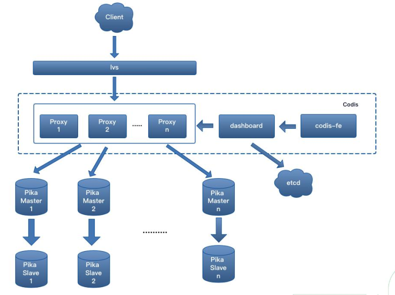

# Pika

## Pika简介 [English](https://github.com/Qihoo360/pika/blob/master/README.md)

Pika 是一个以 RocksDB 为存储引擎的的大容量、高性能、多租户、数据可持久化的弹性 KV 数据存储系统，完全兼容 Redis 协议，支持其常用的数据结构，如 string/hash/list/zset/set/geo/hyperloglog/pubsub/bitmap/stream 等 [Redis 接口](https://github.com/OpenAtomFoundation/pika/wiki/pika-%E6%94%AF%E6%8C%81%E7%9A%84redis%E6%8E%A5%E5%8F%A3%E5%8F%8A%E5%85%BC%E5%AE%B9%E6%83%85%E5%86%B5)。 

Redis 的内存使用了超过 16GiB 时，会面临内存容量有限、单线程阻塞、启动恢复时间长、内存硬件成本贵、缓冲区容易写满、一主多从故障时切换代价大等问题。Pika 的出现并不是为了替代 Redis, 而是 Redis 补充。Pika 力求在完全兼容Redis 协议、继承 Redis 便捷运维设计的前提下，通过持久化存储的方式解决了 Redis 一旦存储数据量巨大就会出现内存容量不足的瓶颈问题，并且可以像 Redis 一样，支持使用 slaveof 命令实现主从模式，还支持数据的全量同步和增量同步。

还可以通过 twemproxy or [Codis](https://github.com/OpenAtomFoundation/pika/tree/unstable/cluster) 以静态数据分片方式实现 Pika 集群。

## Pika特性

* 协议兼容：完全兼容 Redis 协议，且极力追求高性能、大容量、低成本、大规模
* 数据结构：支持 Redis 的常用数据结构 String、Hash、List、Zset、Set、Geo、Hyperloglog、Pubsub、Bitmap、Stream、ACL etc
* 冷热数据：对热数据做缓存，将全量数据持久化存储到 RocksDB，并且实现冷热分级存储
* 极大容量：相比于 Redis 的内存存储方式，Pika 支持百 GB 的数据量级，能极大减少服务器资源占用，增强数据的可靠性
* 部署方式：单机主从模式(slaveof)和 Codis 集群模式，扩缩容简单
* 迁移简单：不用修改代码即可平滑从 Redis 迁移到 Pika
* 便于运维：完善的[运维](https://github.com/OpenAtomFoundation/pika/wiki/pika%E7%9A%84%E4%B8%80%E4%BA%9B%E7%AE%A1%E7%90%86%E5%91%BD%E4%BB%A4%E6%96%B9%E5%BC%8F%E8%AF%B4%E6%98%8E)命令文档

## Pika解决的问题及应用场景

Pika 力求在完全兼容 Redis 协议、 继承 Redis 便捷运维设计的前提下， 通过持久化存储的方式解决 Redis 在大容量场景下的问题， 如：


## Pika架构之存储引擎

* 支持多平台 CentOS、Ubuntu、macOS
* 多线程模型
* 基于 RocksDB 的存储引擎
* 多粒度数据缓存模型


## 部署模式

### 1、主从模式

* 架构与 Redis 类似
* 与 Redis 协议和数据结构兼容良好
* 每种数据结构使用一个 RocksDB 实例
* 主从采用 Binlog 异步复制方式


### 2、分布式集群模式

* 采用 Codis 架构，支持多 group
* 单 group 内是一个主从集
* 以 group 为单位进行弹性伸缩



## Pika用户展示

<table>
<tr>
<td height="100" width="150"></td>
<td height="100" width="150"></td>
<td height="100" width="150"></td>
<td height="100" width="150"></td>
</tr>
<tr>
<td height="100" width="150"></td>
<td height="100" width="150"></td>
<td height="100" width="150"></td>
<td height="100" width="150"></td>
</tr>
<tr>
<td height="100" width="150"></td>
<td height="100" width="150"></td>
<td height="100" width="150"></td>
<td height="100" width="150"></td>
</tr>
<tr>
<td height="100" width="150"></td>
<td height="100" width="150"></td>
<td height="100" width="150"></td>
<td height="100" width="150"></td>
</tr>
<tr>
<td height="100" width="150"></td>
<td height="100" width="150"></td>
<td height="100" width="150"></td>
<td height="100" width="150"></td>
</tr>
</table>

* 360公司内部部署使用规模 10000+ 实例，单实例数据量 1.8TB；
* 微博公司内部部署实例 10000+；
* 喜马拉雅(X Cache)实例数量 6000+，数据量 120TB+；
* 个推公司内部部署 300+ 实例，总数据量30TB+；
* 还有迅雷、小米、知乎、好未来、快手、搜狐、美团、脉脉等。[更多](https://github.com/Qihoo360/pika/blob/master/USERS.md)

## Pika快速上手

### 1、二进制包方式

用户可以直接从[releases](https://github.com/Qihoo360/pika/releases)下载最新的二进制版本包使用.

### 2、源码编译方式

* #### 2.1 支持的平台

  * Linux - CentOS
  * Linux - Ubuntu
  * macOS(Darwin)

* #### 2.2 依赖的库软件

  * gcc g++ 支持C++17 （version>=9）
  * make
  * cmake（version>=3.18）
  * autoconf
  * tar

* #### 2.3 编译过程

  * 2.3.1. 获取源代码

    ```bash
      git clone https://github.com/OpenAtomFoundation/pika.git
    ```

  * 2.3.2. 切换到最新 release 版本

    ```bash
      git tag          # 查看最新的 release tag，（如 v3.4.1）
      git checkout TAG # 切换到最新版本，（如 git checkout v3.4.1）
    ```

  * 2.3.3. 执行编译

    > 如果在 CentOS6、CentOS7 等 gcc 版本小于 9 的机器上，需要先升级 gcc 版本，执行如下命令：
    >
    > ```bash
    >   sudo yum -y install centos-release-scl
    >   sudo yum -y install devtoolset-9-gcc devtoolset-9-gcc-c++
    >   scl enable devtoolset-9 bash
    > ```

    第一次编译时，建议使用构建脚本 `build.sh`，该脚本会检查本机上是否有编译所需的软件。

    ```bash
      ./build.sh
    ```

    > 注：编译后的文件会保存到 `output` 目录下。

    Pika 默认使用 `release` 模式编译，不支持调试，如果需要调试，请使用 `debug` 模式编译。

    ```bash
      rm -rf output/
      cmake -B output -DCMAKE_BUILD_TYPE=Debug
      cd output && make
    ```

    其他子组件，如 `codis` 和 `pika_operator` 也可以用 `build.sh` 进行编译。

    ```bash
      # 编译 codis, 默认 target，build-all
      ./build.sh codis

      # 编译 codis, 但只构建 codis-proxy
      ./build.sh codis codis-proxy

      # 编译 pika_operator
      ./build.sh operator
    ```

* #### 2.4 启动 Pika

  ```bash
    ./output/pika -c ./conf/pika.conf
  ```

* #### 2.5 清空已编译的结果

  如果需要清空编译内容，视不同情况，以下两种方法可任选其一：

  方法 1：仅清理本次编译内容

  ```bash
    cd output && make clean
  ```

  方法 2：彻底重新编译

  ```bash
    rm -rf output # 重新生成cmake
  ```

* #### 2.6 Pika 的开发调试

  [Pika 使用 CLion 搭建开发调试环境](./docs/ops/SetUpDevEnvironment.md)

### 3、容器化

* #### 3.1 使用docker运行

  ```bash
  docker run -d \
    --restart=always \
    -p 9221:9221 \
    -v <log_dir>:/pika/log \
    -v <db_dir>:/pika/db \
    -v <dump_dir>:/pika/dump \
    -v <dbsync_dir>:/pika/dbsync \
    pikadb/pika:v3.3.6

  redis-cli -p 9221 "info"
  ```

* #### 3.2 构建自有镜像

  如果你想自己构建镜像，我们提供了一个脚本 `build_docker.sh` 来简化这个过程。

  该脚本接受几个可选参数：

  * `-t tag`: 指定镜像的 Docker 标签。默认情况下，标签是 `pikadb/pika:<git tag>`。
  * `-p platform`: 指定 Docker 镜像的平台。选项有 `all`、 `linux/amd64`、 `linux/arm`、 `linux/arm64`，默认使用当前 docker 的 platform 设置。
  * `--proxy`: 使用代理下载 package 以加快构建过程，构建时会使用阿里云的镜像源。
  * `--help`: 显示帮助信息。

  以下是一个使用示例：

  ```bash
  ./build_docker.sh -p linux/amd64 -t private_registry/pika:latest
  ```

* #### 3.3 使用 pika-operator 部署

  使用 `pika-operator` 可以简单地在 Kubernetes 环境中部署单实例 `pika` 。
  >注：__请勿在生产环境中使用此功能__。

  本地安装：

  1. 安装 [MiniKube](https://minikube.sigs.k8s.io/docs/start/)

  2. 部署 Pika-operator

    ```bash
    cd tools/pika_operator
    make minikube-up # run this if you don't have a minikube cluster
    make local-deploy
    ```

  3. 创建 Pika 实例

    ```bash
    cd tools/pika_operator
    kubectl apply -f examples/pika-sample/
    ```

  4. 检查 Pika 状态

    ```bash
      kubectl get pika pika-sample
    ```

  5. 获取 Pika 实例信息

    ```bash
    kubectl run pika-sample-test \
      --image redis -it --rm --restart=Never \
      -- /usr/local/bin/redis-cli -h pika-sample -p 9221 info
    ```

## Pika 未来工作规划

### 1、Pika 单机版

* 1. 更换 Pika 网络库
* 2. 升级 Pika存储引擎
* 3. 极致性能， 通过提升硬件、 软件提升pika单机版及集群版的性能
* 4. Remote-Compaction
* 5. Pika-Serverless

### 2、Pika 集群版

* 1. 提升 Slot 迁移速度， 提升 Operator 扩缩容的效率
* 2. 升级 Codis-proxy
* 3. Pika-operator
* 4. Codis-proxy性能指标监控

## Pika 发版特性时间轴


## 性能测试 (感谢[deep011](https://github.com/deep011)提供性能测试结果)

> 注: 本测试结果是在特定环境特定场景下得出的，不能够代表所有环境及场景下的表现，__仅供参考__。

__推荐大家在使用 Pika 前在自己的环境，根据使用场景详细测试以评估 Pika 是否满足要求。__

### 1、测试环境

* CPU型号：Intel(R) Xeon(R) CPU E5-2690 v4 @ 2.60GHz
* CPU线程数：56
* MEMORY：256G
* DISK：3T flash
* NETWORK：10GBase-T/Full * 2
* OS：CentOS 6.6
* Pika版本：2.2.4

### 2、压测工具

[vire-benchmark](https://deep011.github.io/vire-benchmark)

### 3、测试案例

#### 3.1 案例一

* ##### 测试目的

  测试 Pika 在不同 worker 线程数量下，其 QPS 上限。

* ##### 测试条件

  * Pika 数据容量：800G
  * value：128字节
  * CPU未绑定

* ##### 测试结果

  

  > 注：
  > 横轴表示 Pika 线程数，纵轴表示 QPS，value 为128字节。
  > set3/get7 表示 30% 的 set 和 70% 的 get。

* ##### 案例一结论

  从上图可以看出，Pika 的 worker 线程数设置为 20~24 比较划算。

#### 3.2 案例二

* ##### 测试目的

  测试在最佳 worker 线程数（20线程）下，Pika 的 RTT 表现。

* ##### 测试条件

  * Pika数据容量：800G
  * value：128字节

* ##### 测试结果

  ```c
  ====== GET ======
    10000000 requests completed in 23.10 seconds
    200 parallel clients
    3 bytes payload
    keep alive: 1
  99.89% <= 1 milliseconds
  100.00% <= 2 milliseconds
  100.00% <= 3 milliseconds
  100.00% <= 5 milliseconds
  100.00% <= 6 milliseconds
  100.00% <= 7 milliseconds
  100.00% <= 7 milliseconds
  432862.97 requests per second
  ```

  ```c
  ====== SET ======
    10000000 requests completed in 36.15 seconds
    200 parallel clients
    3 bytes payload
    keep alive: 1
  91.97% <= 1 milliseconds
  99.98% <= 2 milliseconds
  99.98% <= 3 milliseconds
  99.98% <= 4 milliseconds
  99.98% <= 5 milliseconds
  99.98% <= 6 milliseconds
  99.98% <= 7 milliseconds
  99.98% <= 9 milliseconds
  99.98% <= 10 milliseconds
  99.98% <= 11 milliseconds
  99.98% <= 12 milliseconds
  99.98% <= 13 milliseconds
  99.98% <= 16 milliseconds
  99.98% <= 18 milliseconds
  99.99% <= 19 milliseconds
  99.99% <= 23 milliseconds
  99.99% <= 24 milliseconds
  99.99% <= 25 milliseconds
  99.99% <= 27 milliseconds
  99.99% <= 28 milliseconds
  99.99% <= 34 milliseconds
  99.99% <= 37 milliseconds
  99.99% <= 39 milliseconds
  99.99% <= 40 milliseconds
  99.99% <= 46 milliseconds
  99.99% <= 48 milliseconds
  99.99% <= 49 milliseconds
  99.99% <= 50 milliseconds
  99.99% <= 51 milliseconds
  99.99% <= 52 milliseconds
  99.99% <= 61 milliseconds
  99.99% <= 63 milliseconds
  99.99% <= 72 milliseconds
  99.99% <= 73 milliseconds
  99.99% <= 74 milliseconds
  99.99% <= 76 milliseconds
  99.99% <= 83 milliseconds
  99.99% <= 84 milliseconds
  99.99% <= 88 milliseconds
  99.99% <= 89 milliseconds
  99.99% <= 133 milliseconds
  99.99% <= 134 milliseconds
  99.99% <= 146 milliseconds
  99.99% <= 147 milliseconds
  100.00% <= 203 milliseconds
  100.00% <= 204 milliseconds
  100.00% <= 208 milliseconds
  100.00% <= 217 milliseconds
  100.00% <= 218 milliseconds
  100.00% <= 219 milliseconds
  100.00% <= 220 milliseconds
  100.00% <= 229 milliseconds
  100.00% <= 229 milliseconds
  276617.50 requests per second
  ```

* ##### 案例二结论

  get/set 响应时间 99.9% 都在 2ms 以内。

#### 3.3 案例三

* ##### 测试目的

  在 Pika 最佳的 worker 线程数下，查看各命令的极限QPS。

* ##### 测试条件

  * Pika 的 worker 线程数：20
  * key 数量：10000
  * field 数量：100（list除外）
  * value：128字节
  * 命令执行次数：1000万（lrange 除外）

* ##### 测试结果

  ```c
  PING_INLINE: 548606.50 requests per second
  PING_BULK: 544573.31 requests per second
  SET: 231830.31 requests per second
  GET: 512163.91 requests per second
  INCR: 230861.56 requests per second
  MSET (10 keys): 94991.12 requests per second
  LPUSH: 196093.81 requests per second
  RPUSH: 195186.69 requests per second
  LPOP: 131156.14 requests per second
  RPOP: 152292.77 requests per second
  LPUSH (needed to benchmark LRANGE): 196734.20 requests per second
  LRANGE_10 (first 10 elements): 334448.16 requests per second
  LRANGE_100 (first 100 elements): 50705.12 requests per second
  LRANGE_300 (first 300 elements): 16745.16 requests per second
  LRANGE_450 (first 450 elements): 6787.94 requests per second
  LRANGE_600 (first 600 elements): 3170.38 requests per second
  SADD: 160885.52 requests per second
  SPOP: 128920.80 requests per second
  HSET: 180209.41 requests per second
  HINCRBY: 153364.81 requests per second
  HINCRBYFLOAT: 141095.47 requests per second
  HGET: 506791.00 requests per second
  HMSET (10 fields): 27777.31 requests per second
  HMGET (10 fields): 38998.52 requests per second
  HGETALL: 109059.58 requests per second
  ZADD: 120583.62 requests per second
  ZREM: 161689.33 requests per second
  PFADD: 6153.47 requests per second
  PFCOUNT: 28312.57 requests per second
  PFADD (needed to benchmark PFMERGE): 6166.37 requests per second
  PFMERGE: 6007.09 requests per second
  ```

* ##### 结论

  整体表现很不错，个别命令表现较弱（LRANGE，PFADD，PFMERGE）。

#### 3.4 案例四

* ##### 测试目的

  Pika 与 Redis 的极限 QPS 对比。

* ##### 测试条件

  * Pika 的 worker 线程数：20
  * key 数量：10000
  * field 数量：100（list除外）
  * value：128字节
  * 命令执行次数：1000万（lrange 除外）
  * Redis 版本：3.2.0

* ##### 测试结果


## 可观测性

### Metrics

* 1. Pika Server Info：系统架构、IP、端口、run_id、配置文件等
* 2. Pika Data Info：DB 大小、日志大小、内存使用情况等
* 3. Pika ClientsInfo：连接的客户端
* 4. Pika Stats Info：compact、slot等状态信息
* 5. Pika Network Info：客户端和主从复制的传入和传出流量以及速率
* 6. Pika CPU Info：CPU使用情况
* 7. Pika Replication Info：主从复制的状态信息，binlog 信息等
* 8. Pika Keyspace Info：五种数据类型的 Key 信息
* 9. Pika Command Exec Count Info：命令执行计数
* 10. Pika Command Execution Time：命令执行耗时
* 11. RocksDB Metrics：五种数据类型的 RocksDB 信息，包括 Memtable、Block Cache、Compaction、SST File、Blob File 等。

详细请参考 [指标 Metrics](tools/pika_exporter/README.md)。

## 文档

* [wiki](https://github.com/OpenAtomFoundation/pika/wiki)

* release notes
  -  [What's new in Pika v3.5.2](https://my.oschina.net/dubbogo/blog/10315913)
  -  [What's new in Pika v3.5.1](https://my.oschina.net/dubbogo/blog/10114890)
  -  [What's new in Pika v3.5.0](https://mp.weixin.qq.com/s/NNnmd0RtQ-vx9arW9YBcBA)

## 联系方式


* [Slack Channel](https://join.slack.com/t/w1687838400-twm937235/shared_invite/zt-1y72dch5d-~9CuERHYUSmfeJZh32Z~qQ)

* QQ群：294254078
