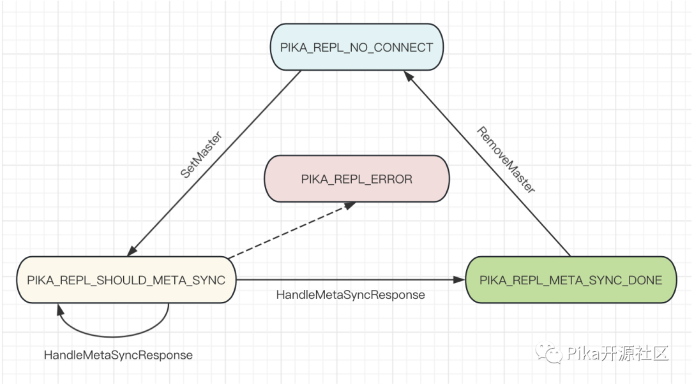
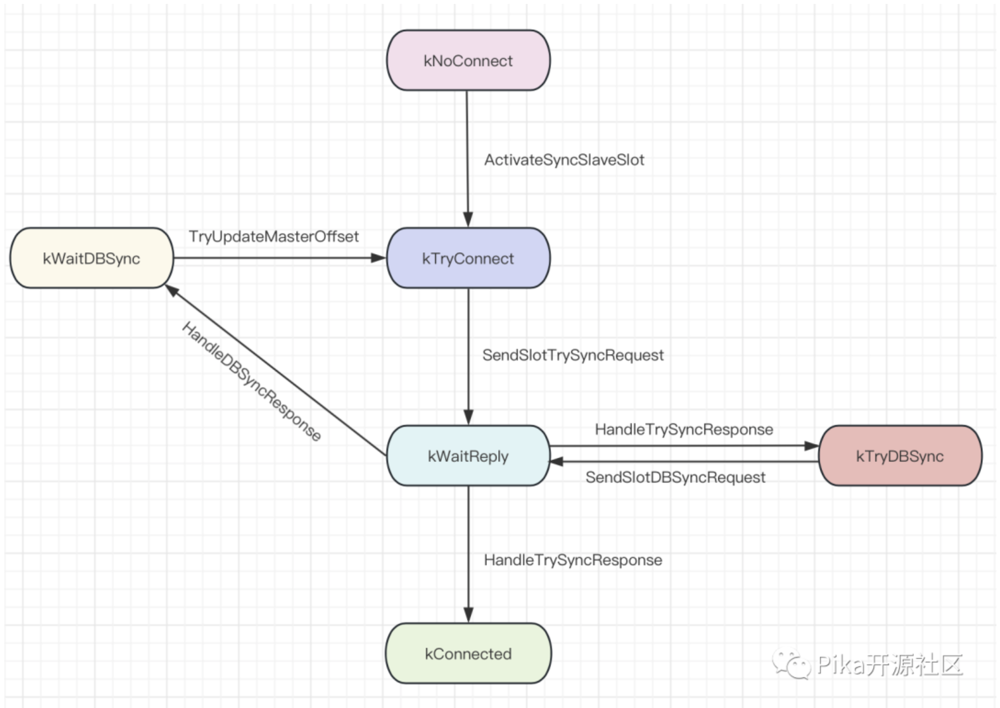

## 1 背景

Pika V3.5.0 之前的版本，主从节点进行全量数据同步是通过 rsync 命令实现的。不少使用者在使用过程中遇到了这样的问题：

1. rsync 命令需要单独启动一个进程作为 Pika 子进程实现数据传输，在 Pika 进程 重启/退出或者机器故障 等情况下 rsync 进程与 Pika 进程无法同步退出；
2. 也有用户在使用过程中发现 Pika 进程正常运行但 rsync 进程异常退出，无法定位原因。

综上，我们考虑去除 rsync 实现新的文件全量传输机制，新机制需实现：

1. 支持限速策略且可以动态调整
2. 传输性能与之前的 rsync 方式相当
3. 可处理网络丢包、重传、主从节点宕机等异常情况

## 2 旧主从复制流程

Pika 支持了 Redis 中的 slaveof 命令，用于把不同的 Pika 实例组织成一个新的数据副本集，实现这些实例之间的数据同步，包括全量同步和增量同步。

Pika 中使用了两个状态机和 auxilary_thread 后台线程维护整个同步状态，主从同步整体执行流程为：  <br>
1.（client 节点）通过 redis-cli 向 slave 节点发命令，命令中携带 master 的 ip + port  <br>
2.（slave 节点）收到 slaveof 请求，设置 master，修改 conf 文件，初始化状态机 <br> 
3.（slave 节点）向 master 发送 MetaSync 请求，用来比对主从节点的 DB 拓扑结构是否一致  <br>
4.（master 节点）处理 MetaSync 请求，返回 DB 拓扑信息 <br> 
5.（slave 节点）每个 slot 单独向 master 端发送 TrySync 请求，同步自己的 binlog offset  <br>
6.（master 节点）比对 slave slot 的 binlog 读取点以及 master-run-id，计算是否可以进行增量同步 <br>
7.（slave 节点）根据回包中的 reply_code 判断进行增量同步还是全量同步 <br>
8.（slave 节点）如需全量同步，slot 发送 DBsync 请求给 master <br>
9.（master 节点）dump 引擎文件，启动后台线程使用 rsync 工具同步文件全量推送到 slave <br>
10.（slave 节点）周期性检测是否已经收到 bgsave info 文件（master 会在最后才同步 info 文件），收到之后，校验数据，changedb，完成历史数据同步。如果 slave 对应的 binlog offset 在 master 上仍存在，开始进行增量同步流程。<br>

整体同步流程涉及到两个状态机，第一个状态机表示 pika_server 状态，主要用于 slave 节点收到 slaveof 请求之后到开始同步数据之前的状态流转，这些状态有：

- PIKA_REPL_NO_CONNECT
- PIKA_REPL_SHOULD_META_SYNC
- PIKA_REPL_META_SYNC_DONE
- PIKA_REPL_ERROR

  
第二个状态机表示每个 slot 的状态，状态包括：

- kNoConnect
- kTryConnect
- kTryDBSync
- kWaitDBSync
- kWaitReply
- kConnected
- kError
- kDBNoConnect

  
**注**：图中集中在增量同步之前阶段的状态转移，未包含请求错误导致状态流转到 kError 的情况，也没有包括连接 keepalive 超时或连接断开时状态被重置为 kNoConnect 的过程。

状态流转通过 AuxiliaryThread 线程的大 while 循环与网络库的回调函数完成：

**1 PIKA_REPL_NO_CONNECT -> PIKA_REPL_SHOULD_META_SYNC:** 当 slave 节点收到 slaveof 节点请求之后，会调用 removeMaster 删除已有的 master，接着调用 SetMaster 设置 pika_server 的状态为 meta_sync。

**2 PIKA_REPL_SHOULD_META_SYNC -> PIKA_REPL_SHOULD_METASYNC_DONE:** Pika AuxiliaryThread 在大循环中检测到该状态之后，执行 SendMetaSyncRequest 向 master 节点发起 MetaSync 请求。当 slave 节点收到 MetaSync 的回包之后，会执行 HandleMetaSyncResponse 函数，如果请求成功，比对主从节点的 DB 拓扑结构，如果一致，将状态变为 PIKA_REPL_META_SYNC_DONE，同时激活 SyncSlaveSlot 状态机，将 slot 状态流转到 kTryConnect。之后开始 slot 的状态流转。

**3 kNoConnect -> kTryConnect:** MetaSync 阶段执行完成后，会启动 SyncSlaveSlot 的状态机，并将状态流转到 kTryConnect。

**4 kTryConnect -> kWaitReply:** PikaAuxiliaryThread 检测到某个 slot 处于该状态之后，发送 TrySync 命令给 master，同步 binlog offset 给 master，同时获取 master 的 DB 拓扑。之后状态流转到 kWaitReply 等待接收回包。

**5 kWaitReply -> kConnected:** 收到 TrySync 命令的回包之后，如果 master 节点有对应 binlog 的 offset，状态流转到 kConnected。

**6 kWaitReply -> kTryDBSync:** 收到 TrySync 命令的回包之后，如果 master 节点没有对应 binlog 的 offset，状态流转到 kTryDBSync。

**7 kTryDBSync -> kWaitDBSync:** 对处于 kWaitDBSync 状态的 slot，AuxiliaryThread 会发送 dbsync 命令给 master，slot 状态重新流转到 kWaitReply。

**8 kWaitReply -> kWaitDBSync:** 收到 dbsync 回包之后，状态流转到 kWaitDBSync。等待 master 通过 Rsync 推送引擎文件。AuxiliaryThread 会周期性地对处于 kWaitDBSync 状态的 slot 执行 TryUpdateMasterOffset，其主要工作就是检查数据同步是否已经完成，如果已经完成，切 DB，更新状态为 kTryConnect，重新发送 TrySync 比对 binlog offset。

## 3 新方案

新的主从复制将替代之前的历史数据迁移功能，对应上一节中的步骤 9。类似于之前的同步方式，新的数据同步也是基于 client-server 模式，节点启动时都需要启动一个 server。不同的是，传输数据时，slave 节点作为 client 端，master 节点作为 server 端，slave 从 server 端拉取引擎文件并进行加载。之所以采取 pull 的方式，有两方面考虑：

1. push 方式相比 pull 方式要保存更多的元数据。为支持传输限速以及大文件传输，单个文件需拆分为多个 block 进行传输。如果使用 pull 模式，只需要 slave 记录需要拉取的文件和 offset，master 只需要根据请求参数读取指定文件片段数据即可。使用 push 的方式，master 和 slave 端都需要记录元信息，且需要网络交互对齐。
2. 使用 push 方式需要处理的异常场景更多。包括网络异常，节点宕机等，主从节点都需要进行处理。使用 pull 方式，异常处理只需要由 slave 节点控制。整体的架构比较简单，slave 端使用 RsyncClient 拉取文件，master 端使用 RsyncServer 监听端口并处理请求。

slave 端整体的执行流程是：

1. 当 slave 节点上 slot 状态流转到 kWaitDBSync 后，初始化 RsyncClient。RsyncClient 在初始化阶段完成 recover 操作，请求 master 节点获取本次数据传输的元信息。
2. 如果初始化成功，启动 RsyncClient 多个后台下载线程从 master 下载引擎文件。
3. 当所有引擎文件下载完成，slave 校验 info 文件，changedb，更新 slot 状态为 kTryConnect。

master 端整体的执行流程是：

master 端处理逻辑较为简单，只需要保证在 dump 完成之后根据请求中指定的文件名和 offset 从磁盘中读取文件然后将数据传回给 slave 即可。

### 新机制数据传输过程

新方案中使用 protobuf 方式序列化待传输数据，slave 节点主动向 master 拉取文件内容。每个文件可能被拆分为多次网络请求。具体每次请求中传输多少数据量根据限速策略进行调整。proto 文件定义如下所示。

```bash
syntax = "proto2";
package RsyncService;

enum Type {
    kRsyncMeta = 1;
    kRsyncFile = 2;
}

enum StatusCode {
    kOk  = 1;
    kErr = 2;
}

message MetaResponse {
    repeated string filenames = 1;
}

message FileRequest {
    required string filename = 1;
    required uint64 count = 2;
    required uint64 offset = 3;
}

message FileResponse {
    required int32 eof = 1;
    required uint64 count = 2;
    required uint64 offset = 3;
    required bytes data = 4;
    required string checksum = 5;
    required string filename = 6;
}

message RsyncRequest {
    required Type type = 1;
    required int32 reader_index = 2;
    required string db_name = 3;
    required uint32 slot_id = 4;
    optional FileRequest file_req = 5;
}

message RsyncResponse {
    required Type type = 1;
    required int32 reader_index = 2;
    required string snapshot_uuid = 3;
    required string db_name = 4;
    required uint32 slot_id = 5;
    required StatusCode code = 6;
    optional MetaResponse meta_resp = 7;
    optional FileResponse file_resp = 8;
}
```

请求包括两种类型，一个是获取元信息，slave 获取 master dump 相关信息，包括 snapshot_uuid（唯一关联一个 dump），待传输的文件集合。另一个是拉取具体的文件，通过请求参数中的 filename，offset 和 count 指定了要获取的文件片段。回包中包含了传输数据内容，所属文件名以及 offset 用于 slave 端过滤掉无效的数据包，如延时到达的回包或重复的回包。为加快数据传输的速度，可以在配置文件中修改后台拉取文件的线程数，也可以通过动态调整限速策略控制数据传输速度。

### 下载限速

文件下载限速的逻辑，参考 braft 中 install_snapshot 的限速策略实现了 throttle 类，总体思路是限制 slave 节点单位时间内下载的数据量。具体使用上，分别设置每秒最多下载的字节数和统计周期。默认的 slave 节点单次请求的数据量最多是 4MB，发送请求之前会先从 throttle 类获取当前统计周期中还可以发送的数据量，如果可以发送的数据量为 0，sleep 一个统计周期。如果不为 0，修改请求中需要获取的数据量。当请求收到回包之后，用实际收到的回包中的数据量更新 throttle 中的余额。