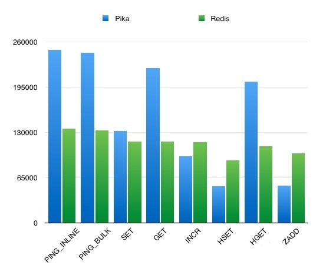
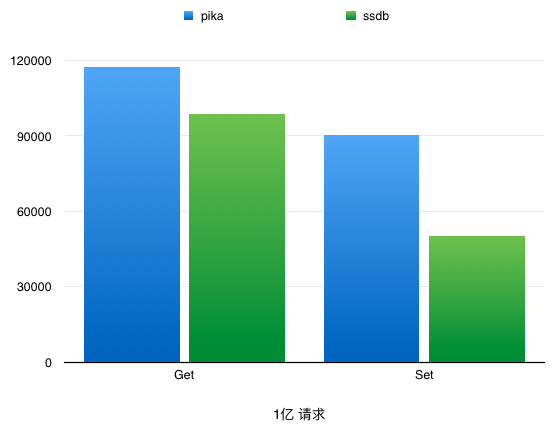
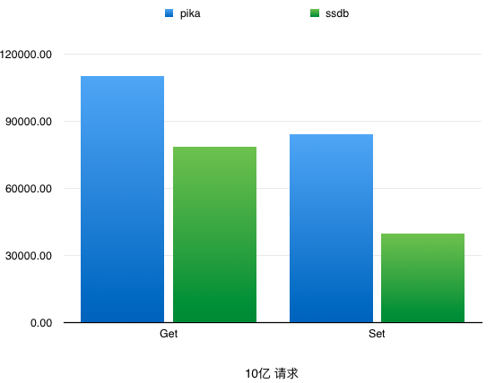
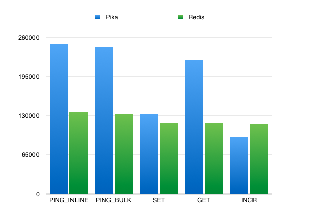

## Pika是什么

Pika是DBA和基础架构组联合开发的类Redis 存储系统，所以完全支持Redis协议，用户不需要修改任何代码，就可以将服务迁移至Pika。Pika是一个可持久化的大容量Redis存储服务，兼容string、hash、list、zset、set的绝大接口[兼容详情](ops/API.md)，解决Redis由于存储数据量巨大而导致内存不够用的容量瓶颈，并且可以像Redis一样，通过slaveof命令进行主从备份，支持全同步和部分同步。同时DBA团队还提供了迁移工具， 所以用户不会感知这个迁移的过程，迁移是平滑的。
 
## 与Redis的比较
Pika相对于Redis，最大的不同就是Pika是持久化存储，数据存在磁盘上，而Redis是内存存储，由此不同也给Pika带来了相对于Redis的优势和劣势

### 优势：
1. 容量大：Pika没有Redis的内存限制, 最大使用空间等于磁盘空间的大小
2. 加载db速度快：Pika在写入的时候, 数据是落盘的, 所以即使节点挂了, 不需要rdb或者oplog，Pika重启不用加载所有数据到内存就能恢复之前的数据, 不需要进行回放数据操作。
3. 备份速度快：Pika备份的速度大致等同于cp的速度（拷贝数据文件后还有一个快照的恢复过程，会花费一些时间），这样在对于百G大库的备份是快捷的，更快的备份速度更好的解决了主从的全同步问题

### 劣势：
由于Pika是基于内存和文件来存放数据, 所以性能肯定比Redis低一些, 但是我们一般使用SSD盘来存放数据, 尽可能跟上Redis的性能。

## 适用场景
从以上的对比可以看出, 如果你的业务场景的数据比较大，Redis 很难支撑， 比如大于50G，或者你的数据很重要，不允许断电丢失，那么使用Pika 就可以解决你的问题。
而在实际使用中，Pika的性能大约是Redis的50%。

## Pika的特点
1. 容量大，支持百G数据量的存储
2. 兼容Redis，不用修改代码即可平滑从Redis迁移到Pika
3. 支持主从(slaveof)
4. 完善的运维命令 

## 当前适用情况
目前Pika在线上部署并运行了20多个巨型（承载数据与Redis相比）集群
粗略的统计如下：当前每天承载的总请求量超过100亿，当前承载的数据总量约3TB

## 与Redis的性能对比
### 配置
- CPU: 24 Cores, Intel® Xeon® CPU E5-2630 v2 @ 2.60GHz
- MEM: 165157944 kB
- OS: CentOS release 6.2 (Final)
- NETWORK CARD: Intel Corporation I350 Gigabit Network Connection

### 测试过程
在 Pika 中先写入 150G 大小的数据，写入 Hash key 50 个，field 1千万级别。
Redis 写入 5G 大小的数据。
Pika：18 个线程
Redis：单线程
 

### 结论
Pika 的单线程的性能肯定不如 Redis，Pika 是多线程的结构，因此在线程数比较多的情况下，某些数据结构的性能可以优于 Redis。

## Pika 部分场景性能概况
### Pika vs SSDB ([Detail](pikaVsSSDB.md))

## Pika vs Redis

## 如何从Redis迁移到Pika

### 开发需要做的
开发不需要做任何事，不用改代码、不用替换driver（Pika使用原生redis的driver），什么都不用动，看dba干活就好

### DBA需要做的
1. DBA迁移Redis数据到Pika
1. DBA将Redis的数据实时同步到Pika，确保Redis与Pika的数据始终一致
1. DBA切换LVS后端ip，由Pika替换Redis

 
 

 
 
