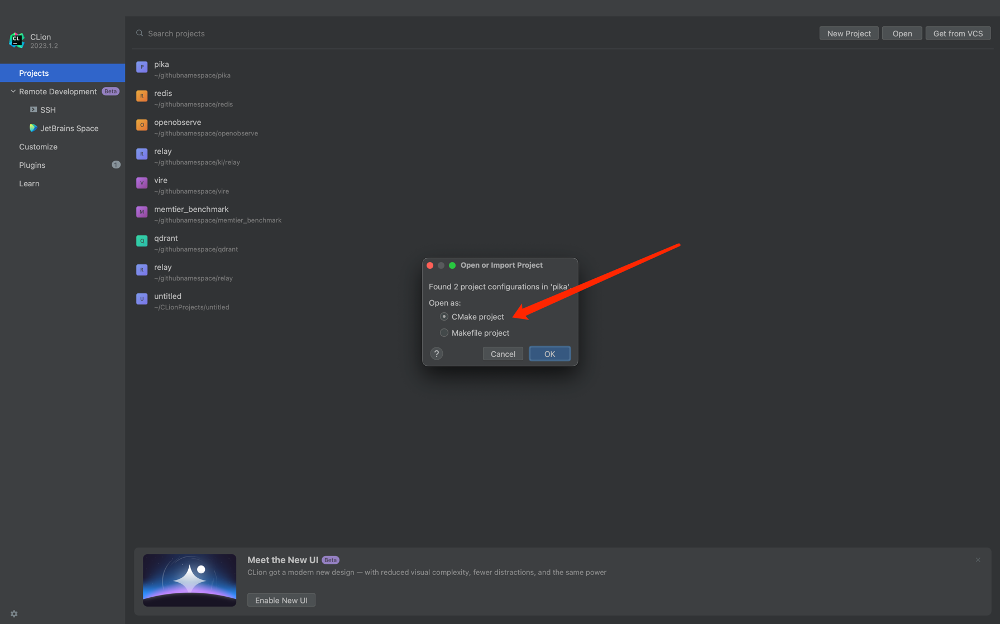
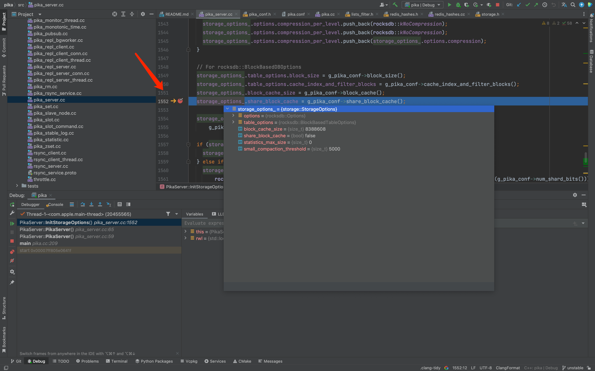

## Pika 开发调试环境搭建
本篇面向开发者，介绍如何使用 CLion 搭建 Pika 的开发调试环境。

### 1. 下载安装 CLion

CLion 是 JetBrains 推出的 C/C++ IDE，支持 Linux、Windows、macOS 等多个平台，支持多种编译器，包括 GCC、Clang 等。
- 下载地址：[https://www.jetbrains.com/clion/download/](https://www.jetbrains.com/clion/download/)

### 2. clone Pika 源码

```bash
$ git clone https://github.com/OpenAtomFoundation/pika.git
```

### 3. 打开 Pika 项目

选择 Open，打开 Pika 并选择 CMake 项目。


### 4. 配置 CLion 

CLion 默认会使用 Ninja 作为构建工具，但 Pika 使用的是 Makefile，所以需要修改 CLion 的配置。


### 5. 编译 Pika

在 Run/Debug Configuration -> Cmake Application 里选中 Pika， 点击 Debug 按钮，开始编译 Pika。编译完成后，看到如下输出，说明编译成功。
```
Pika module 3.5.0
usage: pika [-hv] [-c conf/file]
-h               -- show this help
-c conf/file     -- config file
-v               -- show version
example: ./output/bin/pika -c ./conf/pika.conf
```


### 6. 运行并调试 Pika

运行 Pika 时，需要设置 Pika 的配置文件。在 Run/Debug Configuration -> Cmake Application -> Pika 里配置 Pika 的配置文件 `-c ../conf/pika.conf`，如下图所示。


配置好后点击 Debug 按钮，开始运行 Pika。运行成功后，可以在 CLion 的控制台看到 Pika 的输出。

```log
.............          ....     .....       .....           .....         
#################      ####     #####      #####           #######
####         #####     ####     #####    #####            #########       
####          #####    ####     #####  #####             ####  #####      
####         #####     ####     ##### #####             ####    #####     
################       ####     ##### #####            ####      #####
####                   ####     #####   #####         #################   
####                   ####     #####    ######      #####         #####  
####                   ####     #####      ######   #####           ##### 
-----------Pika config end----------
W20230921 17:13:42.294183 20438988 pika.cc:188] your 'limit -n ' of 10240 is not enough for Redis to start. pika have successfully reconfig it to 25000
I20230921 17:13:42.294448 20438988 pika.cc:207] Server at: ../conf/pika.conf
I20230921 17:13:42.295454 20438988 net_interfaces.cc:62] got interface lo0
I20230921 17:13:42.295512 20438988 net_interfaces.cc:104] Using Networker Interface: lo0
I20230921 17:13:42.295610 20438988 net_interfaces.cc:148] got ip 127.0.0.1
I20230921 17:13:42.295637 20438988 pika_server.cc:137] host: 127.0.0.1 port: 9221
I20230921 17:13:42.295723 20438988 pika_server.cc:79] Worker queue limit is 20100
W20230921 17:13:42.295754 20438988 pika_server.cc:80] 0.0.0.0
I20230921 17:13:42.296372 20438988 net_kqueue.cc:23] create kqueue
I20230921 17:13:42.297199 20438988 net_kqueue.cc:23] create kqueue
I20230921 17:13:42.297837 20438988 net_kqueue.cc:23] create kqueue
I20230921 17:13:42.298482 20438988 net_kqueue.cc:23] create kqueue
I20230921 17:13:42.299120 20438988 net_kqueue.cc:23] create kqueue
I20230921 17:13:42.299800 20438988 net_kqueue.cc:23] create kqueue
I20230921 17:13:42.300457 20438988 net_kqueue.cc:23] create kqueue
I20230921 17:13:42.301016 20438988 pika_binlog.cc:80] Binlog: Manifest file not exist, we create a new one.
I20230921 17:13:42.302006 20438988 net_kqueue.cc:23] create kqueue
I20230921 17:13:44.301479 20438988 pika_slot.cc:63] db0 DB Success
I20230921 17:13:44.301918 20438988 net_util.cc:128] TimerTaskThread Starting...
I20230921 17:13:44.302228 20438988 pika_server.cc:204] Pika Server going to start
I20230921 17:13:44.302265 20438988 rsync_server.cc:48] start RsyncServer ...
```

此时，Pika 已经在 CLion 中运行，可以使用 redis-cli 连接 Pika，默认端口 9221，进行调试。



进入断点后，说明 Pika 调试模式运行成功。

