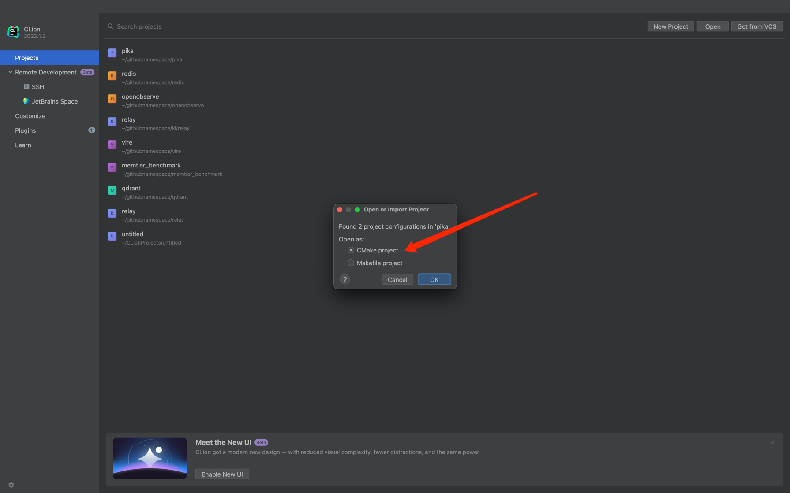
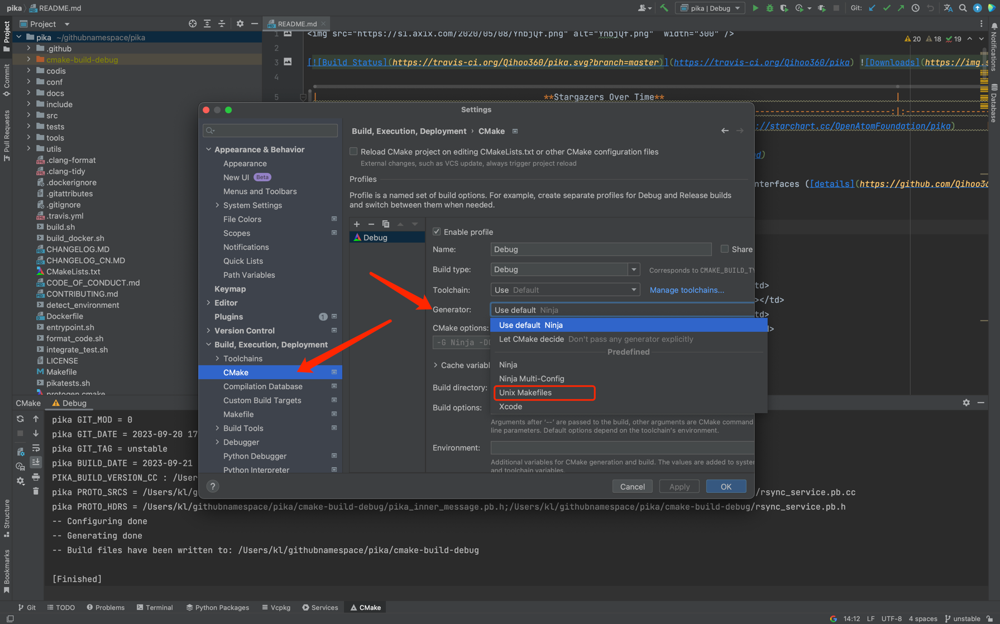
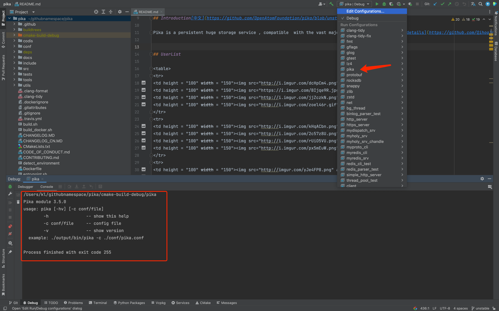
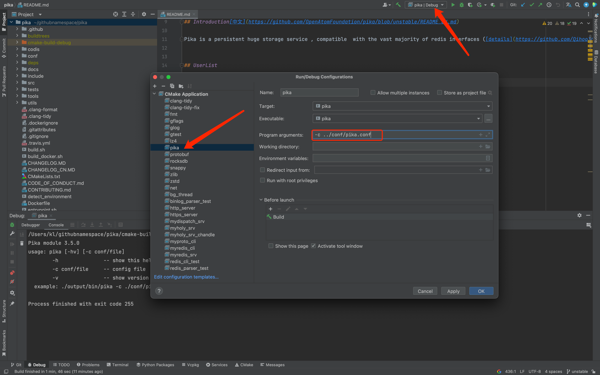
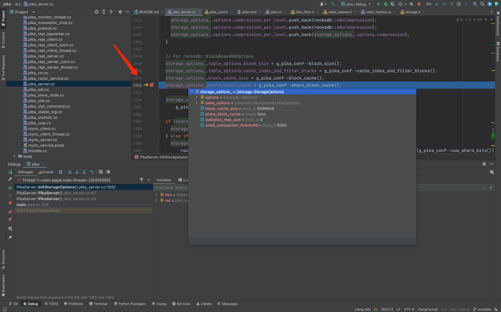

## How to setting up a development and debugging environment

This article is aimed at developers and it introduces how to set up a development and debugging environment for Pika using CLion.

### 1. Download and install CLion

CLion is a C/C++ IDE developed by JetBrains. It supports multiple platforms such as Linux, Windows, and macOS, and it also supports various compilers including GCC and Clang.
- Download link：[https://www.jetbrains.com/clion/download/](https://www.jetbrains.com/clion/download/)

### 2. Clone the Pika source code

```bash
$ git clone https://github.com/OpenAtomFoundation/pika.git
```

### 3. Open the Pika

Choose Open and select CMake project.


### 4. Configure CLion

CLion by default uses Ninja as the build tool, but Pika uses Makefile. Therefore, the CLion configuration needs to be modified.


### 5. Compile Pika

In the Run/Debug Configuration -> Cmake Application, select Pika, click the Debug button to start compiling Pika. After the compilation is completed, if you see the following output, it means the compilation is successful.
```
Pika module 3.5.0
usage: pika [-hv] [-c conf/file]
-h               -- show this help
-c conf/file     -- config file
-v               -- show version
example: ./output/bin/pika -c ./conf/pika.conf
```



### 6. Run and debug Pika

When running Pika, it is necessary to configure its configuration file. This can be done by configuring Pika's configuration file in Run/Debug Configuration -> Cmake Application -> Pika. `-c ../conf/pika.conf`，As shown in the following picture.



After configuring, click the Debug button to start running Pika. Once it runs successfully, you can see the "PIKA" in CLion's console.

```log
.............          ....     .....       .....           .....         
#################      ####     #####      #####           #######
####         #####     ####     #####    #####            #########       
####          #####    ####     #####  #####             ####  #####      
####         #####     ####     ##### #####             ####    #####     
################       ####     ##### #####            ####      #####
####                   ####     #####   #####         #################   
####                   ####     #####    ######      #####         #####  
####                   ####     #####      ######   #####           ##### 
-----------Pika config end----------
W20230921 17:13:42.294183 20438988 pika.cc:188] your 'limit -n ' of 10240 is not enough for Redis to start. pika have successfully reconfig it to 25000
I20230921 17:13:42.294448 20438988 pika.cc:207] Server at: ../conf/pika.conf
I20230921 17:13:42.295454 20438988 net_interfaces.cc:62] got interface lo0
I20230921 17:13:42.295512 20438988 net_interfaces.cc:104] Using Networker Interface: lo0
I20230921 17:13:42.295610 20438988 net_interfaces.cc:148] got ip 127.0.0.1
I20230921 17:13:42.295637 20438988 pika_server.cc:137] host: 127.0.0.1 port: 9221
I20230921 17:13:42.295723 20438988 pika_server.cc:79] Worker queue limit is 20100
W20230921 17:13:42.295754 20438988 pika_server.cc:80] 0.0.0.0
I20230921 17:13:42.296372 20438988 net_kqueue.cc:23] create kqueue
I20230921 17:13:42.297199 20438988 net_kqueue.cc:23] create kqueue
I20230921 17:13:42.297837 20438988 net_kqueue.cc:23] create kqueue
I20230921 17:13:42.298482 20438988 net_kqueue.cc:23] create kqueue
I20230921 17:13:42.299120 20438988 net_kqueue.cc:23] create kqueue
I20230921 17:13:42.299800 20438988 net_kqueue.cc:23] create kqueue
I20230921 17:13:42.300457 20438988 net_kqueue.cc:23] create kqueue
I20230921 17:13:42.301016 20438988 pika_binlog.cc:80] Binlog: Manifest file not exist, we create a new one.
I20230921 17:13:42.302006 20438988 net_kqueue.cc:23] create kqueue
I20230921 17:13:44.301479 20438988 pika_slot.cc:63] db0 DB Success
I20230921 17:13:44.301918 20438988 net_util.cc:128] TimerTaskThread Starting...
I20230921 17:13:44.302228 20438988 pika_server.cc:204] Pika Server going to start
I20230921 17:13:44.302265 20438988 rsync_server.cc:48] start RsyncServer ...
```

At this point, Pika is already running in CLion, and you can use redis-cli to connect to Pika for debugging purposes. The default port is 9221.



Entering the breakpoint indicates that Pika debugging mode is running successfully.

