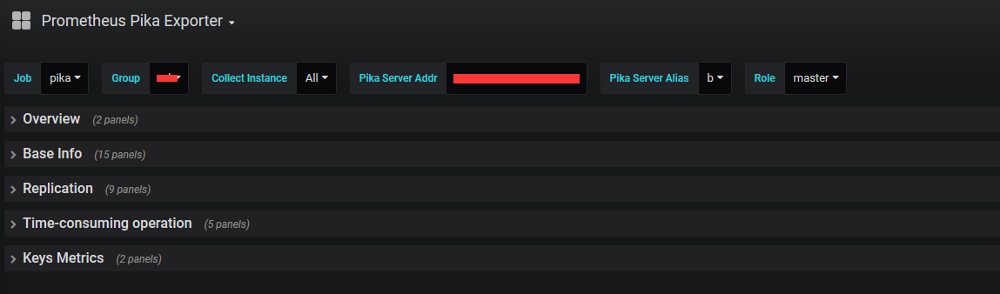
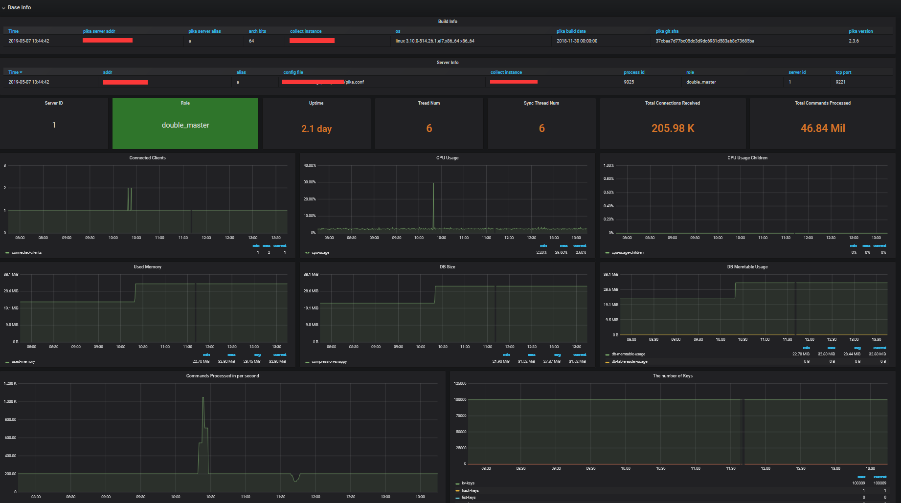
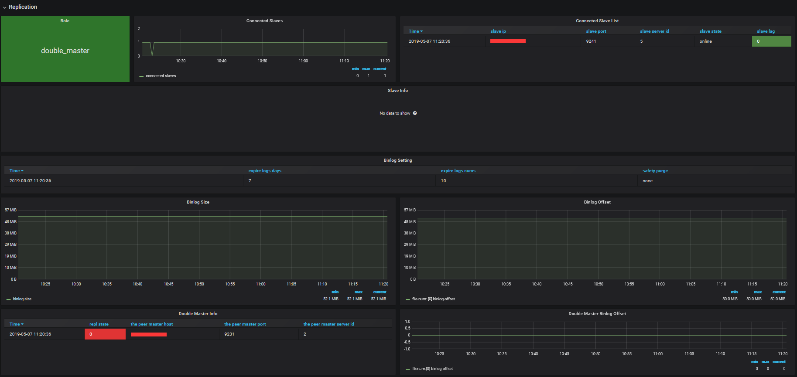
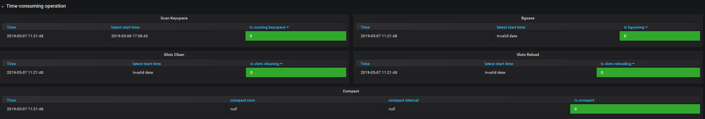
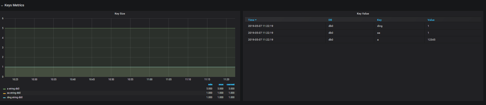

# Pika Metric Exporter #

Prometheus exporter for nosql [Qihoo360/pika](https://github.com/Qihoo360/pika) metrics. 

Pika-Exporter is based on [Redis-Exporter](https://github.com/oliver006/redis_exporter)

## Buiding ##

**Build and run locally:**

To start using `pika_exporter`, install `Go` and run go get
```
$ go get github.com/chenbt-hz/pika/pika-tools/pika_exporter
$ cd $GOPATH/src/github.com/chenbt-hz/pika/pika-tools/pika_exporter
$ make
$ ./bin/pika_exporter <flags>
```


**Prometheus Configuration:**

Add a block to the scrape_configs of your prometheus.yml config file:
```
scrape_configs:

...

- job_name: pika
  scrape_interval: 15s
  static_configs:
  - targets: ['XXXXXX:9121']
    labels:
      group: 'test'

...
```

## Flags ##
| Name                 | Environment Variables              | Default  | Description                                                                                                                                                                                                                                                                                                                       | Example                                       |
|----------------------|------------------------------------|----------|-----------------------------------------------------------------------------------------------------------------------------------------------------------------------------------------------------------------------------------------------------------------------------------------------------------------------------------|-----------------------------------------------|
| pika.host-file       | PIKA_HOST_FILE                     |          | Path to file containing one or more pika nodes, separated by newline. NOTE: mutually exclusive with pika.addr.Each line can optionally be comma-separated with the fields `<addr>`,`<password>`,`<alias>`. See [here](https://github.com/chenbt-hz/pika/pika-tools/pika_exporter/raw/master/contrib/sample_pika_hosts_file.txt) for an example file. | --pika.host-file ./pika_hosts_file.txt        |
| pika.addr            | PIKA_ADDR                          |          | Address of one or more pika nodes, separated by comma.                                                                                                                                                                                                                                                                            | --pika.addr 192.168.1.2:9221,192.168.1.3:9221 |
| pika.password        | PIKA_PASSWORD                      |          | Password for one or more pika nodes, separated by comma.                                                                                                                                                                                                                                                                          | --pika.password 123.com,123.com               |
| pika.alias           | PIKA_ALIAS                         |          | Pika instance alias for one or more pika nodes, separated by comma.                                                                                                                                                                                                                                                               | --pika.alias a,b                              |
| namespace            | PIKA_EXPORTER_NAMESPACE            | pika     | Namespace for metrics                                                                                                                                                                                                                                                                                                             | --namespace pika                              |
| keyspace-stats-clock | PIKA_EXPORTER_KEYSPACE_STATS_CLOCK | -1       | Stats the number of keys at keyspace-stats-clock o'clock every day, in the range [0, 23]. If < 0, not open this feature.                                                                                                                                                                                                          | --keyspace-stats-clock 0                      |
| check.key-patterns   | PIKA_EXPORTER_CHECK_KEY_PARTTERNS  |          | Comma separated list of key-patterns to export value and length/size, searched for with SCAN.                                                                                                                                                                                                                                     | --check.key-patterns db0=test*,db0=*abc*      |
| check.keys           | PIKA_EXPORTER_CHECK_KEYS           |          | Comma separated list of keys to export value and length/size.                                                                                                                                                                                                                                                                     | --check.keys abc,test,wasd                    |
| check.scan-count     | PIKA_EXPORTER_CHECK_SCAN_COUNT     | 100      | When check keys and executing SCAN command, scan-count assigned to COUNT.                                                                                                                                                                                                                                                         | --check.scan-count 200                        |
| web.listen-address   | PIKA_EXPORTER_WEB_LISTEN_ADDRESS   | :9121    | Address to listen on for web interface and telemetry.                                                                                                                                                                                                                                                                             | --web.listen-address ":9121"                  |
| web.telemetry-path   | PIKA_EXPORTER_WEB_TELEMETRY_PATH   | /metrics | Path under which to expose metrics.                                                                                                                                                                                                                                                                                               | --web.telemetry-path "/metrics"               |
| log.level            | PIKA_EXPORTER_LOG_LEVEL            | info     | Log level, valid options: `panic` `fatal` `error` `warn` `warning` `info` `debug`.                                                                                                                                                                                                                                                | --log.level "debug"                           |
| log.format           | PIKA_EXPORTER_LOG_FORMAT           | json     | Log format, valid options: `txt` `json`.                                                                                                                                                                                                                                                                                          | --log.format "json"                           |
| version              |                                    | false    | Show version information and exit.                                                                                                                                                                                                                                                                                                | --version                                     |

## Pika Exporter Metrics Definition ##
Disable Pika-Exporter's process metrics and go metrics.

| Metrics Name                                     | Metric Type | Labels                         | Metrics Value                                       | Metric Desc                                      |
|--------------------------------------------------|-------------|--------------------------------|-----------------------------------------------------|--------------------------------------------------|
| namespace_exporter_collect_duration_seconds      | `Histogram` | {}                             | the duration of pika-exporter collect in seconds    | the duration of pika-exporter collect in seconds |
| namespace_exporter_collect_count                 | `Counter`   | {}                             | the count of pika-exporter collect                  | the count of pika-exporter collect               |
| namespace_exporter_scrape_duration_seconds       | `Histogram` | {addr="", alias=""}            | the duration of pika scrape                         | the each of pika scrape duration in seconds      |
| namespace_exporter_scrape_errors                 | `Counter`   | {addr="", alias=""}            | the count of pika scrape error                      | the each of pika scrape error count              |
| namespace_exporter_last_scrape_error             | `Gauge`     | {addr="", alias="", error=""}  | 0                                                   | the each of pika scrape last error               |
| namespace_exporter_scrape_count                  | `Counter`   | {addr="", alias=""}            | the count of pika scrape                            | the each of pika scrape count                    |
| namespace_up                                     | `Gauge`     | {addr="", alias=""}            | 0 or 1                                              | the each of pika connection status               |


## INFO Metrics Definition ##
Qihoo360/pika Info Description, see：[here](https://github.com/Qihoo360/pika/wiki/pika-info信息说明)

The `Info Metrics` obtained by the **`INFO`** Command.

> Numeric format conversion of indicator values(not case sensitive):
```
   yes => 1 no => 0
   up => 1 down => 0
   online => 1 offline => 0
   null => 0
   The rest of the situation directly converts the string to float, 0 if convert failed.
```

### Pika versions supported `Info Metrics` are as follows: ###
```
Since there are many versions of pika used in the production environment, I cannot confirm them one by one.
If some metrics of the pika version you are using are not in the list below, please contact me via the following several ways and provide your Pika-Info, I will support them soon.

QQ Group: 294254078
QQ:       454211569
Email:    454211569@qq.com or shanfu.ding@gmail.com

```
| Metrics Name                                     | Pika Version         | Metric Type | Labels                                                                                                          | Metrics Value                                  | Metric Desc                                                                                                                                                                                |
|--------------------------------------------------|----------------------|-------------|-----------------------------------------------------------------------------------------------------------------|------------------------------------------------|--------------------------------------------------------------------------------------------------------------------------------------------------------------------------------------------|
| namespace_server_info                            | >= 2.0.0             | `Gauge`     | {addr="", alias="", "os"="", "arch_bits"="", "pika_version"="", "pika_git_sha"="","pika_build_compile_date"=""} | 0                                              | pika binary file build info                                                                                                                                                                |
| namespace_build_info                             | >= 2.0.0             | `Gauge`     | {addr="", alias="", "process_id"="", "tcp_port"="", "config_file"="", "server_id"="", "role"=""}                | 0                                              | pika serve instance info                                                                                                                                                                   |
| namespace_uptime_in_seconds                      | >= 2.0.0             | `Gauge`     | {addr="", alias=""}                                                                                             | the value of `uptime_in_seconds`               | pika serve instance uptime in seconds                                                                                                                                                      |
| namespace_thread_num                             | >= 2.0.0             | `Gauge`     | {addr="", alias=""}                                                                                             | the value of `thread_num`                      | pika serve instance thread num                                                                                                                                                             |
| namespace_sync_thread_num                        | >= 2.0.0             | `Gauge`     | {addr="", alias=""}                                                                                             | the value of `sync_thread_num`                 | pika serve instance thread num                                                                                                                                                             |
| namespace_db_size                                | >= 2.0.0             | `Gauge`     | {addr="", alias="", "compression"=""}                                                                           | the value of `db_size`                         | pika serve instance sync thread num                                                                                                                                                        |
| namespace_used_memory                            | >= 2.0.0             | `Gauge`     | {addr="", alias=""}                                                                                             | the value of `used_memory`                     | pika serve instance total db data size in bytes                                                                                                                                            |
| namespace_db_memtable_usage                      | >= 2.0.0             | `Gauge`     | {addr="", alias=""}                                                                                             | the value of `db_memtable_usage`               | pika serve instance memtable total used memory size in bytes                                                                                                                               |
| namespace_db_tablereader_usage                   | >= 2.0.0             | `Gauge`     | {addr="", alias=""}                                                                                             | the value of `db_tablereader_usage`            | pika serve instance tablereader total used memory size in bytes                                                                                                                            |
| namespace_connected_clients                      | >= 2.0.0             | `Gauge`     | {addr="", alias=""}                                                                                             | the value of `connected_clients`               | pika serve instance total count of connected clients                                                                                                                                       |
| namespace_total_connections_received             | >= 2.0.0             | `Counter`   | {addr="", alias=""}                                                                                             | the value of `total_connections_received`      | pika serve instance total count of received connections from clients                                                                                                                       |
| namespace_instantaneous_ops_per_sec              | >= 2.0.0             | `Gauge      | {addr="", alias=""}                                                                                             | the value of `instantaneous_ops_per_sec`       | pika serve instance prcessed operations in per seconds                                                                                                                                     |
| namespace_total_commands_processed               | >= 2.0.0             | `Counter`   | {addr="", alias=""}                                                                                             | the value of `total_commands_processed`        | pika serve instance total count of processed commands                                                                                                                                      |
| namespace_is_bgsaving                            | >= 2.0.0             | `Gauge`     | {addr="", alias="", "bgsave_name"=""}                                                                           | 0 or 1                                         | pika serve instance bg save info                                                                                                                                                           |
| namespace_is_scaning_keyspace                    | >= 2.0.0             | `Gauge`     | {addr="", alias="", "keyspace_time"=""}                                                                         | 0 or 1                                         | pika serve instance scan keyspace info                                                                                                                                                     |
| namespace_compact                                | >= 2.0.0             | `Gauge`     | {addr="", alias="", "is_compact", compact_cron"="", "compact_interval":""}                                      | 0                                              | pika serve instance compact info                                                                                                                                                           |
| namespace_command_exec_count                     | >= 3.0.0             | `Counter`   | {addr="", alias="", "command"=""}                                                                               | the value of the command executed count        | pika serve instance the count of each command executed                                                                                                                                     |
| namespace_used_cpu_sys                           | >= 2.3.x             | `Counter`   | {addr="", alias=""}                                                                                             | the value of `used_cpu_sys`                    | pika serve instance total count of used cpu sys                                                                                                                                            |
| namespace_used_cpu_user                          | >= 2.3.x             | `Counter`   | {addr="", alias=""}                                                                                             | the value of `used_cpu_user`                   | pika serve instance total count of used cpu user                                                                                                                                           |
| namespace_used_cpu_sys_children                  | >= 2.3.x             | `Counter`   | {addr="", alias=""}                                                                                             | the value of `used_cpu_sys_children`           | pika serve instance children total count of used cpu user"                                                                                                                                 |
| namespace_used_cpu_user_children                 | >= 2.3.x             | `Counter`   | {addr="", alias=""}                                                                                             | the value of `used_cpu_user_children`          | pika serve instance children total count of used cpu user                                                                                                                                  |
| namespace_connected_slaves                       | >= 2.0.0             | `Gauge`     | {addr="", alias=""}                                                                                             | the value of `connected_slaves`                | the count of connected slaves, when pika serve instance's role is master                                                                                                                   |
| namespace_slave_state                            | >= 2.0.0 and < 3.1.0 | `Gauge`     | {addr="", alias="", "slave_sid"="", "slave_ip"="", "slave_port"=""}                                             | parse master `slave info's state`              | pika serve instance slave's state                                                                                                                                                          |
| namespace_slave_lag                              | >= 2.3.x             | `Gauge`     | {addr="", alias="", "slave_sid"="", "slave_conn_fd"="", slave_ip"="", "slave_port"="", "db"=""}                 | parse master `slave info's lag`                | pika serve instance slave's binlog lag, the `slave_sid` value is meaningful when the pika version < 3.1.0, the `slave_conn_fd` and `db` value is meaningful when the pika version >= 3.1.0 |
| namespace_master_link_status                     | >= 2.0.0             | `Gauge`     | {addr="", alias="", "master_host"="", "master_port"=""}                                                         | 0 or 1                                         | connection state between slave and master, when pika serve instance's role is slave                                                                                                        |
| namespace_repl_state                             | >= 2.0.0 and < 3.2.0 | `Gauge`     | {addr="", alias="", "master_host"="", "master_port"="", "repl_state"=""}                                        | 0                                              | sync connection state between slave and master, when pika serve instance's `role` is `slave`                                                                                               |
| namespace_slave_read_only                        | >= 2.0.0 and < 3.2.0 | `Gauge`     | {addr="", alias="", "master_host"="", "master_port"=""}                                                         | 0 or 1                                         | is slave read only, when pika serve instance's role is slave                                                                                                                               |
| namespace_slave_priority                         | >= 3.0.0             | `Gauge`     | {addr="", alias="", "master_host"="", "master_port"=""}                                                         | the value of `slave_priority`                  | slave priority, when pika serve instance's role is slave                                                                                                                                   |
| namespace_double_master_info                     | >= 2.0.0             | `Gauge`     | {addr="", alias="", "the_peer_master_server_id"="", "the_peer_master_host"="", "the_peer_master_port"=""}       | 0                                              | the peer master info, when pika serve instance's role is master and double_master_mode is true                                                                                             |
| namespace_double_master_repl_state               | >= 2.0.0             | `Gauge`     | {addr="", alias="", "the_peer_master_server_id"="", "the_peer_master_host"="", "the_peer_master_port"=""}       | 0 or 1                                         | double master sync state, when pika serve instance's role is master and double_master_mode is true                                                                                         |
| namespace_double_master_recv_info_binlog_filenum | >= 2.0.0             | `Gauge`     | {addr="", alias="", "the_peer_master_server_id"="", "the_peer_master_host"="", "the_peer_master_port"=""}       | the value of `double_master_recv_info filenum` | double master recv binlog file num, when pika serve instance's role is master and double_master_mode is true                                                                               |
| namespace_double_master_recv_info_binlog_offset  | >= 2.0.0             | `Gauge`     | {addr="", alias="", "the_peer_master_server_id"="", "the_peer_master_host"="", "the_peer_master_port"=""}       | the value of `double_master_recv_info offset`  | double master recv binlog offset, when pika serve instance's role is master and double_master_mode is true                                                                                 |
| namespace_log_size                               | >= 2.0.0             | `Gauge`     | {addr="", alias=""}                                                                                             | the value of `log_size`                        | pika serve instance total binlog size in bytes                                                                                                                                             |
| namespace_binlog_offset_filenum                  | < 3.1.0              | `Gauge`     | {addr="", alias=""}                                                                                             | the value of `binlog_offset filenum`           | pika serve instance binlog file num                                                                                                                                                        |
| namespace_binlog_offset                          | < 3.1.0              | `Gauge`     | {addr="", alias="", "safety_purge"="", "expire_logs_days"="", "expire_logs_nums"=""}                            | the value of `binlog_offset offset`            | pika serve instance binlog offset                                                                                                                                                          |
| namespace_binlog_offset_filenum_db               | >= 3.1.0             | `Gauge`     | {addr="", alias="", "db"=""}                                                                                    | the value of `binlog_offset offset` each db    | pika serve instance binlog file num for each db                                                                                                                                            |
| namespace_binlog_offset_db                       | >= 3.1.0             | `Gauge`     | {addr="", alias="", "db"="", "safety_purge"=""}                                                                 | the value of `binlog_offset offset` each db    | pika serve instance binlog offset for each db                                                                                                                                              |
| namespace_keys                                   | >= 2.0.0             | `Gauge`     | {addr="", alias="", "db"="", "type"=""}                                                                         | the value of `keys`                            | pika serve instance total count of the db's key-type keys, the `db` value is meaningful when the pika version >= 3.1.0                                                                     |
| namespace_expire_keys                            | >= 3.0.5             | `Gauge`     | {addr="", alias="", "db"="", "type"=""}                                                                         | the value of `expire_keys`                     | pika serve instance total count of the db's key-type expire keys, the `db` value is meaningful when the pika version >= 3.1.0                                                              |
| namespace_invalid_keys                           | >= 3.0.5             | `Gauge`     | {addr="", alias="", "db"="", "type"=""}                                                                         | the value of `invalid_keys`                    | pika serve instance total count of the db's key-type invalid keys, the `db` value is meaningful when the pika version >= 3.1.0                                                             |


## Keys Metrics Definition ##
You can export values of keys if they're in numeric format by using the --check.key-patterns or --check.keys flag. The pika_exporter will export the size (or, depending on the data type, the length) and the value of the key.

The name of the collection indicator:
- **`namespace_key_value`**
  Only the value of the key obtained by the GET command

- **`namespace_key_size`**
  When the PFCOUNT command is used to obtain the size of a key from Pika, even if the key is in `KV-Structure`, the return value can be obtained normally and no error message is received.
Since `Hyperloglog` is not commonly used, then the key in `Hyperloglog-Structure` is not supported. The key in `Hyperloglog-Structure` will be treated as a key in `KV-Structure`.

**Please note**:
> Since pika allows duplicate names five times, `SCAN` Command has a priority output order, followed by: string -> hash -> list -> zset -> set;

> Since pika allows the name to be renamed five times, the `TYPE` Command has the priority output order, which is: string -> hash -> list -> zset -> set. If the key exists in the string, then only the string is output. If it does not exist, Then output the hash, and so on.

## Grafana Dashboard ##
See [here](./contrib/grafana_prometheus_pika_dashboard.json)

Screenshots:









