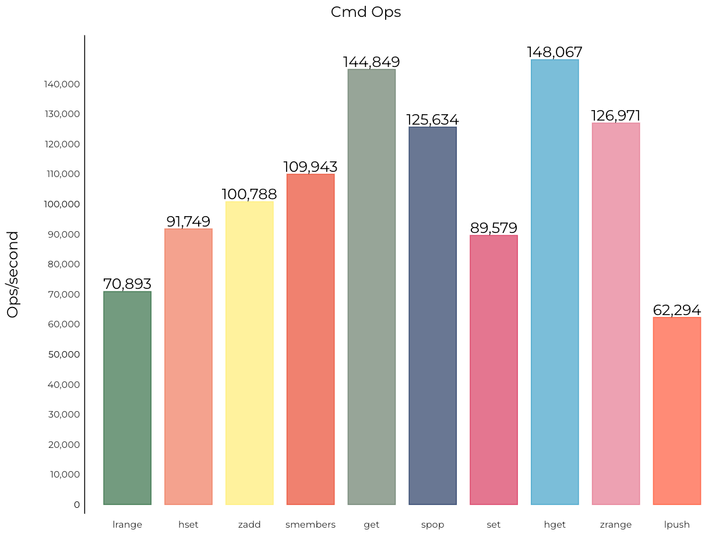
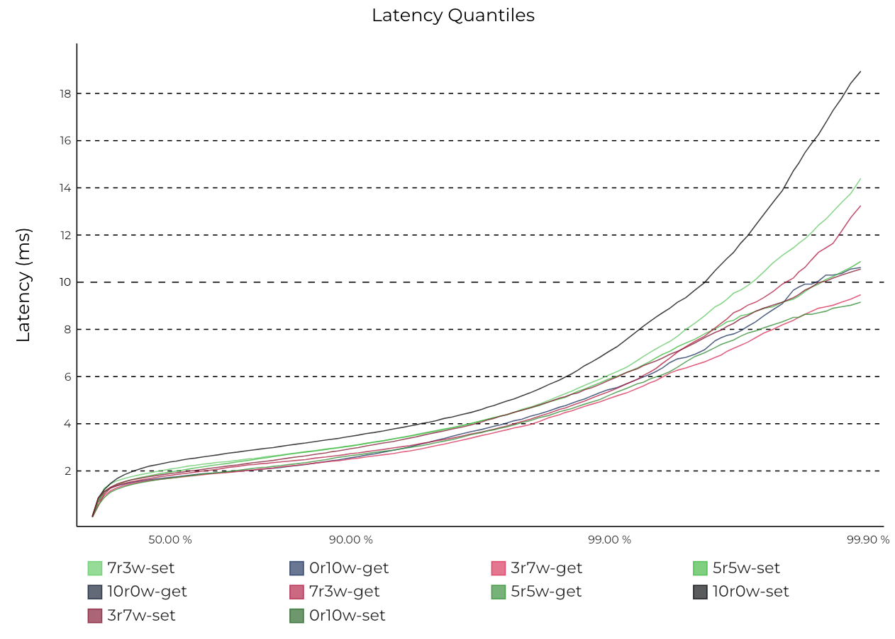
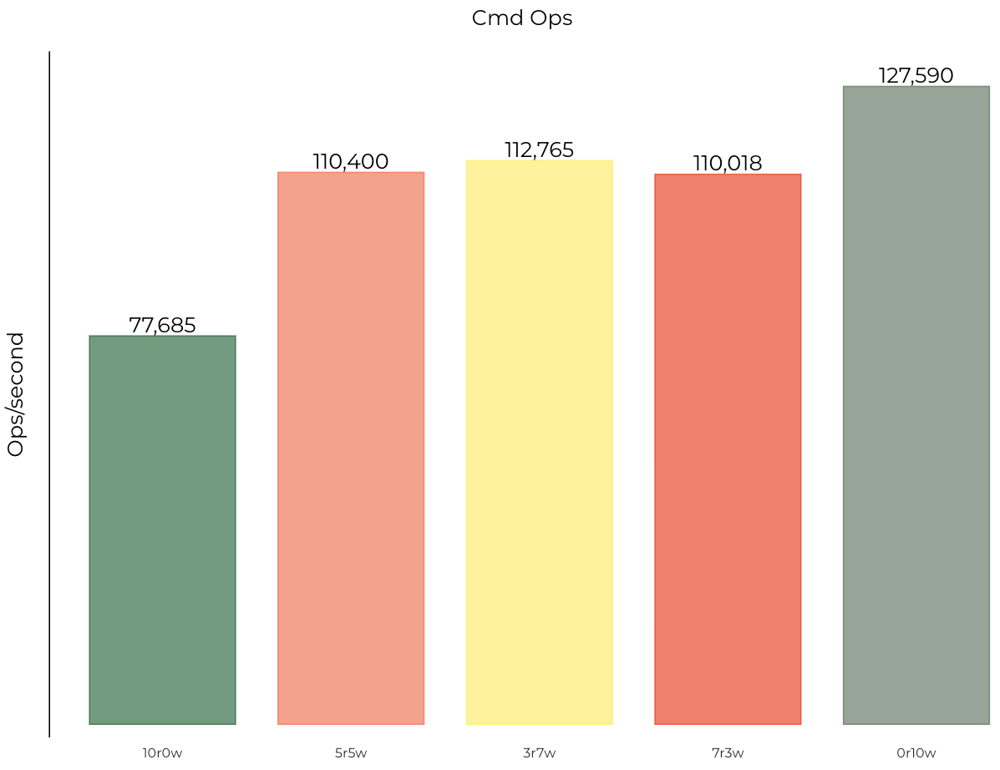

This tool provides stress testing commands for commonly used indicators, and supports one-click generation of visual statistical charts in SVG format from stress testing results to improve stress testing efficiency. The usage steps are as follows:

1、First of all, the stress testing tool uses Redis’ official memtier_benchmark, so you must choose to install this tool. For the installation process, please refer to the official documentation: [https://github.com/RedisLabs/memtier_benchmark](https://github.com /RedisLabs/memtier_benchmark).

2、Next, start a Pika process, and then execute the stress test script to perform the stress test:

```shell
sh pika_benchmark.sh -host 127.0.0.1 -port 9221
```
Currently the following test parameters are supported:
```shell
-host <host>       Server hostname, default: 127.0.0.1
-port <port>       Server port, default: 9221
-requests <requests>   Number of requests, default: 10000
-clients <clients>    Number of concurrent clients, default: 50
-threads <threads>    Number of threads, default: 4
-dataSize <dataSize>   Data size, default: 32
```

3、After the stress test is completed, parse and format the stress test data. First execute go build to compile and convert the program:
```shell
go build parser.go
```

Next, execute the program to format the stress test data. If the output folder does not exist, it needs to be created manually in advance:
```shell
mkdir -p parsed_data

./parser -in_dir=$(pwd)/bench_data -out_dir=$(pwd)/parsed_data
```

4、Use a python script to generate a statistical chart image from the data:
```shell
sh gen_chart.sh
```

After the execution is completed, four svg files will be produced in the ./charts directory. You can directly open them with a browser to see the effect.

5、Currently, the following four pressure measurement charts can be automatically generated:

5.1 Percentile delay statistics chart of commonly used commands:


5.2 OPS statistics chart of commonly used commands:



5.3 Percentile delay statistics chart under different reading and writing scenarios:



5.4 OPS statistics chart under different reading and writing scenarios:


