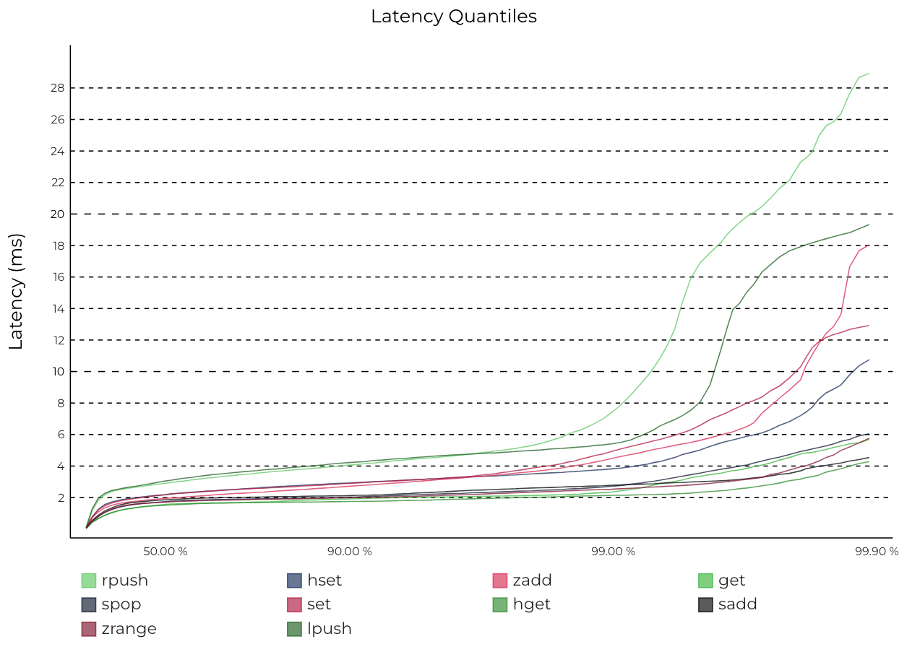
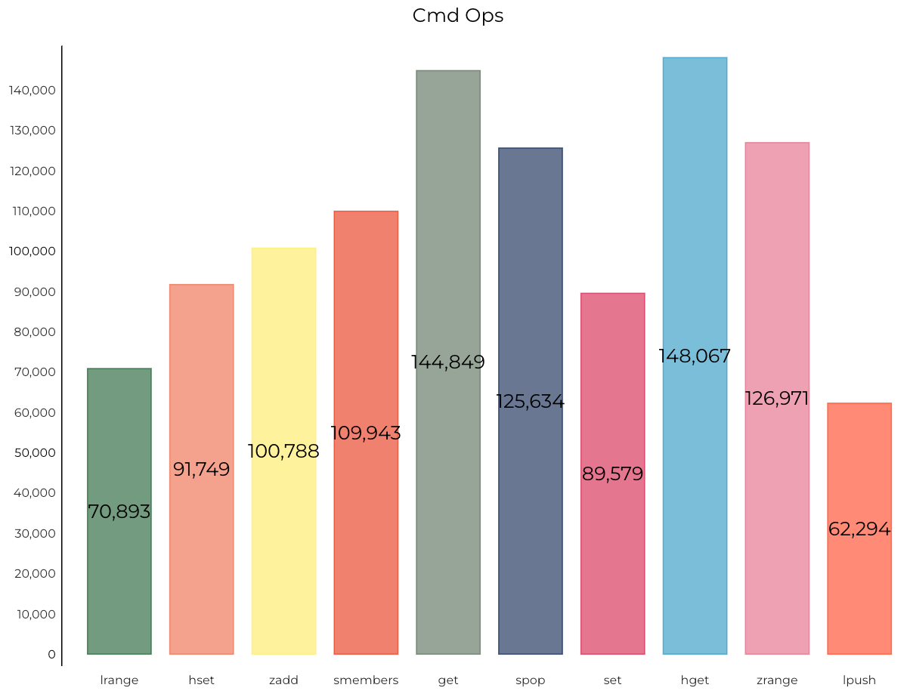
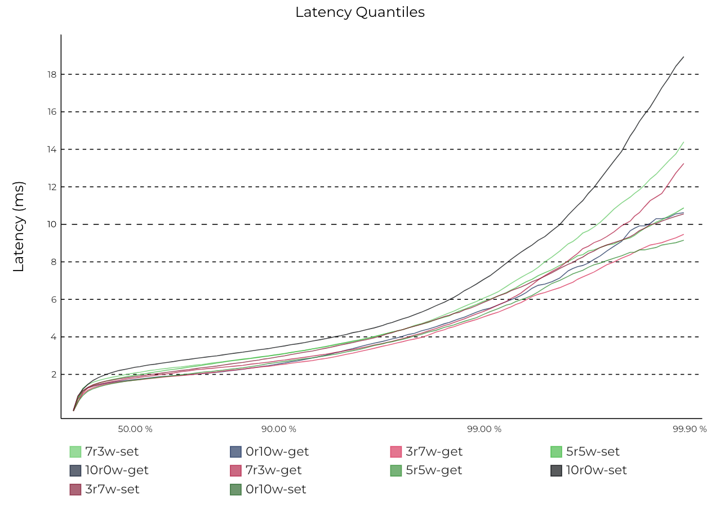
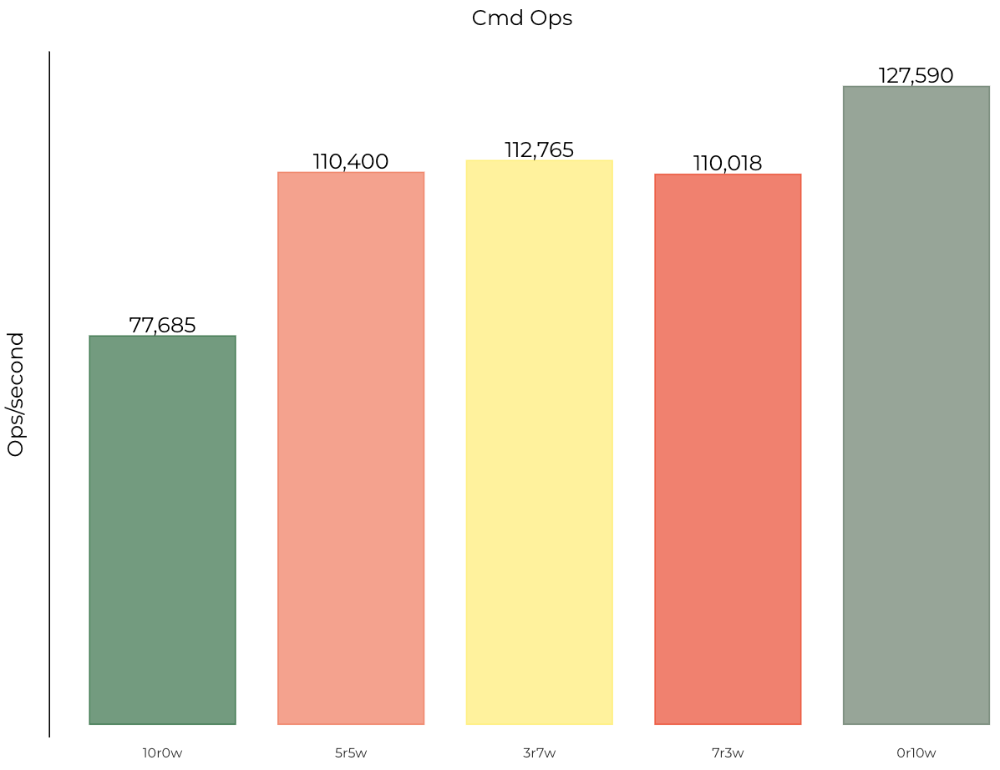

本工具提供了常用指标的压测命令，并支持将压测结果一键生成可视化的 svg 格式的统计图，提升压测效率。使用步骤如下：

1、首先，压测工具使用了 Redis 官方的 memtier_benchmark，所以要选把这个工具安装好，安装流程参考官方文档：[https://github.com/RedisLabs/memtier_benchmark](https://github.com/RedisLabs/memtier_benchmark)。

2、接下来启动一个 Pika 进程，然后执行压测脚本进行压测：
```shell
sh pika_benchmark.sh -host 127.0.0.1 -port 9221
```
目前可支持以下测试参数：
```shell
-host <host>       Server hostname, default: 127.0.0.1
-port <port>       Server port, default: 9221
-requests <requests>   Number of requests, default: 10000
-clients <clients>    Number of concurrent clients, default: 50
-threads <threads>    Number of threads, default: 4
-dataSize <dataSize>   Data size, default: 32
```
3、压测完成后，对压测数据进行解析和格式化。首先执行 go build 编译转换程序：
```shell
go build parser.go
```
接下来执行程序对压测数据进行格式化，如果输出文件夹不存在需要提前手动创建：
```shell
mkdir -p parsed_data

./parser -in_dir=$(pwd)/bench_data -out_dir=$(pwd)/parsed_data
```
4、使用 python 脚本将数据生成统计图图片：
```shell
sh gen_chart.sh
```
执行完成后，会在 ./charts 目录生产四个 svg 文件，直接使用浏览器打开即可看到效果。

5、目前可以自动生成以下四种压测图表：

5.1 常用命令的百分位延时统计图：



5.2 常用命令的 OPS 统计图：



5.3 不同读写场景下的百分位延时统计图：



5.4 不同读写场景下的 OPS 统计图：

