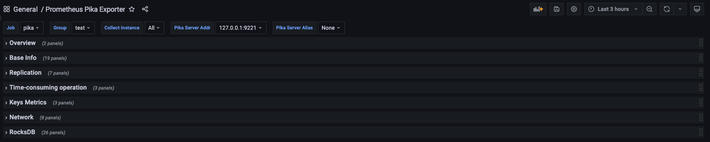
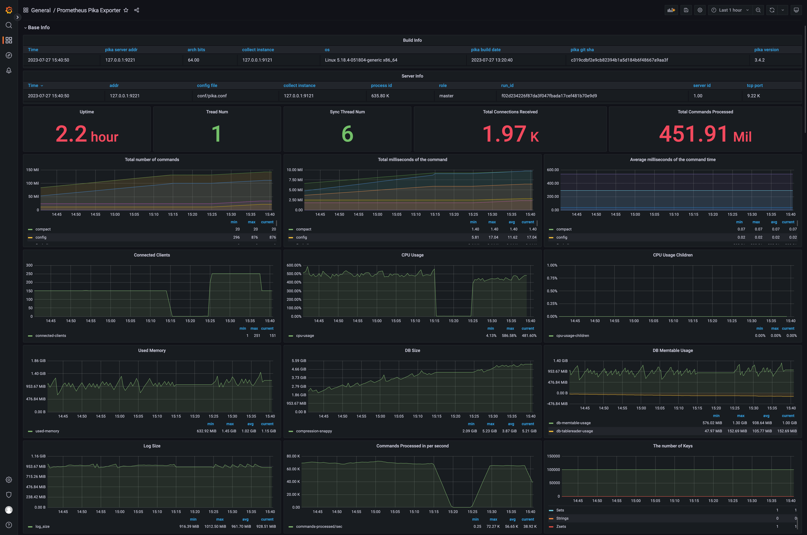
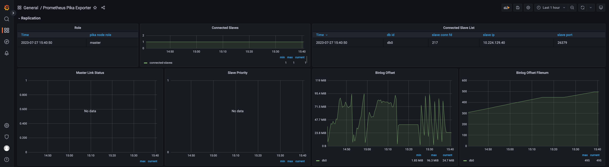
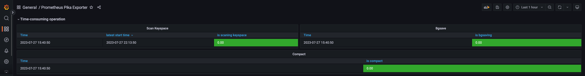
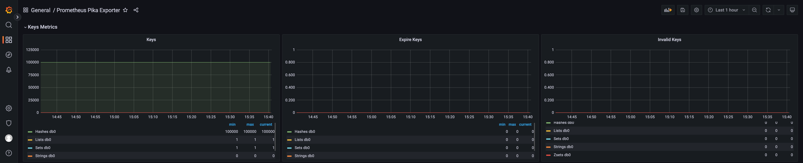
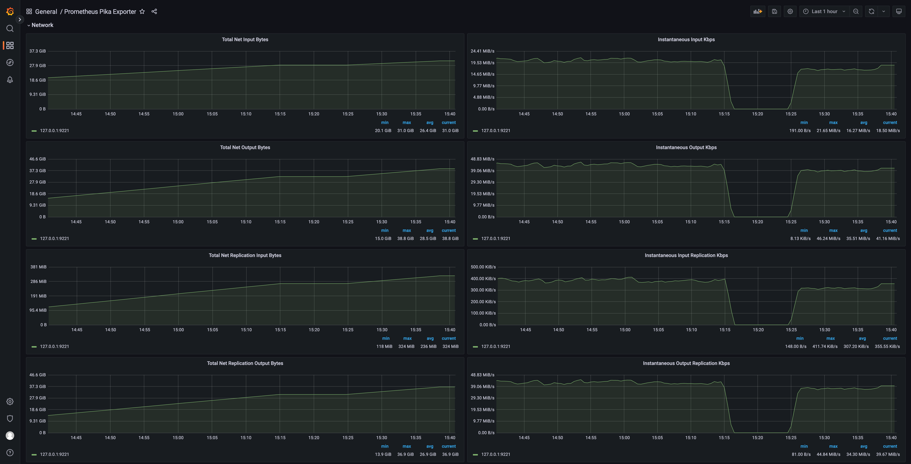
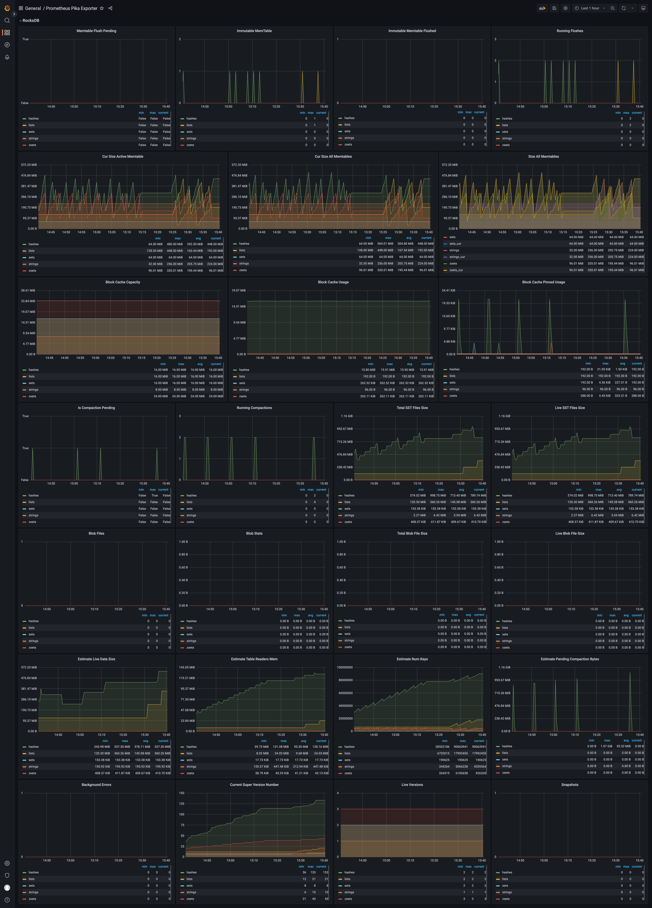

# Pika Metric Exporter #

Prometheus exporter for nosql [Qihoo360/pika](https://github.com/Qihoo360/pika) metrics. 

Pika-Exporter is based on [Redis-Exporter](https://github.com/oliver006/redis_exporter)

## Buiding ##

**Build and run locally:**

To start using `pika_exporter`, install `Go` and run go get
```shell
$ go get github.com/OpenAtomFoundation/pika/tools/pika_exporter
$ cd $GOPATH/src/github.com/OpenAtomFoundation/pika/tools/pika_exporter
$ make
$ ./bin/pika_exporter <flags>
```

For example:
```shell
$ nohup ./bin/pika_exporter -pika.addr 127.0.0.1:9221 &
```


**Prometheus Configuration:**

Add a block to the scrape_configs of your prometheus.yml config file:
```yml
scrape_configs:
  - job_name: pika
    scrape_interval: 15s
    static_configs:
      - targets: ['127.0.0.1:9121']
        labels:
          group: 'test'
```

Run prometheus:

```shell
prometheus --config.file=./grafana/prometheus.yml
```

## Flags ##
| Name                 | Environment Variables              | Default  | Description                                                                                                                                                                                                                                                                                                                       | Example                                       |
|----------------------|------------------------------------|----------|-----------------------------------------------------------------------------------------------------------------------------------------------------------------------------------------------------------------------------------------------------------------------------------------------------------------------------------|-----------------------------------------------|
| pika.host-file       | PIKA_HOST_FILE                     |          | Path to file containing one or more pika nodes, separated by newline. NOTE: mutually exclusive with pika.addr.Each line can optionally be comma-separated with the fields `<addr>`,`<password>`,`<alias>`. See [here](https://github.com/OpenAtomFoundation/pika/tools/pika_exporter/raw/master/contrib/sample_pika_hosts_file.txt) for an example file. | --pika.host-file ./pika_hosts_file.txt        |
| pika.addr            | PIKA_ADDR                          |          | Address of one or more pika nodes, separated by comma.                                                                                                                                                                                                                                                                            | --pika.addr 192.168.1.2:9221,192.168.1.3:9221 |
| pika.password        | PIKA_PASSWORD                      |          | Password for one or more pika nodes, separated by comma.                                                                                                                                                                                                                                                                          | --pika.password 123.com,123.com               |
| pika.alias           | PIKA_ALIAS                         |          | Pika instance alias for one or more pika nodes, separated by comma.                                                                                                                                                                                                                                                               | --pika.alias a,b                              |
| namespace            | PIKA_EXPORTER_NAMESPACE            | pika     | Namespace for metrics                                                                                                                                                                                                                                                                                                             | --namespace pika                              |
| keyspace-stats-clock | PIKA_EXPORTER_KEYSPACE_STATS_CLOCK | -1       | Stats the number of keys at keyspace-stats-clock o'clock every day, in the range [0, 23]. If < 0, not open this feature.                                                                                                                                                                                                          | --keyspace-stats-clock 0                      |
| check.key-patterns   | PIKA_EXPORTER_CHECK_KEY_PARTTERNS  |          | Comma separated list of key-patterns to export value and length/size, searched for with SCAN.                                                                                                                                                                                                                                     | --check.key-patterns db0=test*,db0=*abc*      |
| check.keys           | PIKA_EXPORTER_CHECK_KEYS           |          | Comma separated list of keys to export value and length/size.                                                                                                                                                                                                                                                                     | --check.keys abc,test,wasd                    |
| check.scan-count     | PIKA_EXPORTER_CHECK_SCAN_COUNT     | 100      | When check keys and executing SCAN command, scan-count assigned to COUNT.                                                                                                                                                                                                                                                         | --check.scan-count 200                        |
| web.listen-address   | PIKA_EXPORTER_WEB_LISTEN_ADDRESS   | :9121    | Address to listen on for web interface and telemetry.                                                                                                                                                                                                                                                                             | --web.listen-address ":9121"                  |
| web.telemetry-path   | PIKA_EXPORTER_WEB_TELEMETRY_PATH   | /metrics | Path under which to expose metrics.                                                                                                                                                                                                                                                                                               | --web.telemetry-path "/metrics"               |
| log.level            | PIKA_EXPORTER_LOG_LEVEL            | info     | Log level, valid options: `panic` `fatal` `error` `warn` `warning` `info` `debug`.                                                                                                                                                                                                                                                | --log.level "debug"                           |
| log.format           | PIKA_EXPORTER_LOG_FORMAT           | json     | Log format, valid options: `txt` `json`.                                                                                                                                                                                                                                                                                          | --log.format "json"                           |
| version              |                                    | false    | Show version information and exit.                                                                                                                                                                                                                                                                                                | --version                                     |


## Pika Metrics Definition

### Pika Server Info

| Metrics Name                | Metric Type | Labels                                                                                                          | Metrics Value                    | Metric Desc                                                            |
| --------------------------- | ----------- | --------------------------------------------------------------------------------------------------------------- | -------------------------------- | ---------------------------------------------------------------------- |
| namespace_build_info        | `Gauge`     | {addr="", alias="", "os"="", "arch_bits"="", "pika_version"="", "pika_git_sha"="","pika_build_compile_date"=""} | 1                                | pika binary file build info                                            |
| namespace_server_info       | `Gauge`     | {addr="", alias="", "process_id"="", "tcp_port"="", "config_file"="", "server_id"="", "role"=""}                | 1                                | pika instance's info, the label `role` is the role in replication info |
| namespace_uptime_in_seconds | `Gauge`     | {addr="", alias=""}                                                                                             | the value of `uptime_in_seconds` | pika instance's uptime in seconds                                      |
| namespace_thread_num        | `Gauge`     | {addr="", alias=""}                                                                                             | the value of `thread_num`        | pika instance's thread num                                             |
| namespace_sync_thread_num   | `Gauge`     | {addr="", alias=""}                                                                                             | the value of `sync_thread_num`   | pika instance's thread num for syncing                                 |

### Pika Data Info

| Metrics Name                   | Metric Type | Labels                                | Metrics Value                       | Metric Desc                                                                                                                                                                                             |
| ------------------------------ | ----------- | ------------------------------------- | ----------------------------------- | ------------------------------------------------------------------------------------------------------------------------------------------------------------------------------------------------------- |
| namespace_db_size              | `Gauge`     | {addr="", alias="", "compression"=""} | the value of `db_size`              | total db data size (in bytes) of the pika instance, statistics of all files under the configured `db-path`                                                                                              |
| namespace_log_size             | `Gauge`     | {addr="", alias=""}                   | the value of `log_size`             | total log data size (in bytes) of the pika instance, statistics of all files under the configured `log-path` witch contains INFO, WARNING, ERROR logs and binlog (write2fine) files for synchronization |
| namespace_used_memory          | `Gauge`     | {addr="", alias=""}                   | the value of `used_memory`          | total used memory size (in bytes) of the pika instance                                                                                                                                                  |
| namespace_db_memtable_usage    | `Gauge`     | {addr="", alias=""}                   | the value of `db_memtable_usage`    | total memtable used memory size (in bytes) of the pika instance                                                                                                                                         |
| namespace_db_tablereader_usage | `Gauge`     | {addr="", alias=""}                   | the value of `db_tablereader_usage` | total tablereader used memory size (in bytes) of the pika instance                                                                                                                                      |
| (*new*)namespace_db_fatal             | `Gauge`     | {addr="", alias=""}                   | the value of `db_fatal`             | the metrics value: 1 means errors occurred, 0 means no error                                                                                                                                            |

### Pika Clients Info

| Metrics Name                | Metric Type | Labels              | Metrics Value                    | Metric Desc                                       |
| --------------------------- | ----------- | ------------------- | -------------------------------- | ------------------------------------------------- |
| namespace_connected_clients | `Gauge`     | {addr="", alias=""} | the value of `connected_clients` | total count of connected clients in pika instance |

### Pika Stats Info

| Metrics Name                         | Metric Type | Labels                                                       | Metrics Value                             | Metric Desc                                                                           |
| ------------------------------------ | ----------- | ------------------------------------------------------------ | ----------------------------------------- | ------------------------------------------------------------------------------------- |
| namespace_total_connections_received | `Counter`   | {addr="", alias=""}                                          | the value of `total_connections_received` | total count of received connections from clients in pika instance                     |
| namespace_instantaneous_ops_per_sec  | `Gauge      | {addr="", alias=""}                                          | the value of `instantaneous_ops_per_sec`  | the count of prcessed operations in per seconds by pika instance                      |
| namespace_total_commands_processed   | `Counter`   | {addr="", alias=""}                                          | the value of `total_commands_processed`   | total count of processed commands in pika instance                                    |
| namespace_is_bgsaving                | `Gauge`     | {addr="", alias=""}                                          | 0 or 1                                    | the metrics value: 1 means bgsave is in progress, 0 means bgsave is not in progress   |
| namespace_is_scaning_keyspace        | `Gauge`     | {addr="", alias=""}                                          | 0 or 1                                    | the metrics value: 1 means the keyspace is scanning, 0 means not scanning             |
| namespace_compact                    | `Gauge`     | {addr="", alias="", compact_cron"="", "compact_interval":""} | 0 or 1                                    | the metrics value: 1 means compact is in progress, 0 means compact is not in progress |

### Pika Command Exec Count Info

| Metrics Name                 | Metric Type | Labels                            | Metrics Value                           | Metric Desc                                         |
| ---------------------------- | ----------- | --------------------------------- | --------------------------------------- | --------------------------------------------------- |
| namespace_command_exec_count | `Counter`   | {addr="", alias="", "command"=""} | the value of the command executed count | the count of each command executed in pika instance |

### Pika CPU Info

| Metrics Name                     | Metric Type | Labels              | Metrics Value                         | Metric Desc                                                        |
| -------------------------------- | ----------- | ------------------- | ------------------------------------- | ------------------------------------------------------------------ |
| namespace_used_cpu_user_children | `Counter`   | {addr="", alias=""} | the value of `used_cpu_user_children` | total user CPU usage time (in seconds) of pika children instance   |
| namespace_used_cpu_user          | `Counter`   | {addr="", alias=""} | the value of `used_cpu_user`          | total user CPU usage time (in seconds) of pika instance            |
| namespace_used_cpu_sys_children  | `Counter`   | {addr="", alias=""} | the value of `used_cpu_sys_children`  | total system CPU usage time (in seconds) of pika children instance |
| namespace_used_cpu_sys           | `Counter`   | {addr="", alias=""} | the value of `used_cpu_sys`           | total system CPU usage time (in seconds) of pika instance          |

### Pika Replication Info

| Metrics Name                       | Metric Type | Labels                                                                                   | Metrics Value                                | Metric Desc                                                                                                   |
| ---------------------------------- | ----------- | ---------------------------------------------------------------------------------------- | -------------------------------------------- | ------------------------------------------------------------------------------------------------------------- |
| namespace_connected_slaves         | `Gauge`     | {addr="", alias=""}                                                                      | the value of `connected_slaves`              | the count of connected slaves, when pika instance's role is master                                            |
| (*no exists*)namespace_partition_slave_lag      | `Gauge`     | {addr="", alias="", "slave_conn_fd"="", slave_ip"="", "slave_port"="", "partition"=""}   | parse master `slave info's lag`              | the binlog lag of all slaves of the pika instance                                                             |
| namespace_master_link_status       | `Gauge`     | {addr="", alias="", "master_host"="", "master_port"=""}                                  | 0 or 1                                       | connection state between slave and master(1 means all partitions sync ok), when pika instance's role is slave |
| namespace_slave_read_only          | `Gauge`     | {addr="", alias="", "master_host"="", "master_port"=""}                                  | 0 or 1                                       | is slave read only, when pika instance's role is slave                                                        |
| namespace_slave_priority           | `Gauge`     | {addr="", alias="", "master_host"="", "master_port"=""}                                  | the value of `slave_priority`                | slave priority, when pika instance's role is slave                                                            |
| (*no exists*)namespace_partition_repl_state     | `Gauge`     | {addr="", alias="", "master_host"="", "master_port"="", "partition"="", "repl_state"=""} | 0                                            | sync connection state between slave and master for each partition, when pika instance's role is slave         |
| (*no exists*)namespace_db_binlog_offset_filenum | `Gauge`     | {addr="", alias="", "db"=""}                                                             | the value of `binlog_offset filenum` each db | binlog file num for each db                                                                                   |
| (*no exists*)namespace_db_binlog_offset         | `Gauge`     | {addr="", alias="", "db"="", "safety_purge"=""}                                          | the value of `binlog_offset offset` each db  | binlog offset for each db                                                                                     |
| (*new*)namespace_db_consensus_last_log    | `Gauge`     | {addr="", alias="", "db"="", "last_log"=""}                                              | the value of `consensus last_log` each db    | consensus last_log for each db when consensus-level is enabled                                                |

### Pika Keyspace Info

| Metrics Name                       | Metric Type | Labels                                  | Metrics Value                                        | Metric Desc                                                   |
| ---------------------------------- | ----------- | --------------------------------------- | ---------------------------------------------------- | ------------------------------------------------------------- |
| (*new*)namespace_keyspace_last_start_time | `Gauge`     | {addr="", alias=""}                     | the value of `Keyspace Time` convert to unix seconds | the start time(unix seconds) of the last statistical keyspace |
| namespace_keys                     | `Gauge`     | {addr="", alias="", "db"="", "type"=""} | the value of `keys`                                  | total count of the key-type keys for each db                  |
| namespace_expire_keys              | `Gauge`     | {addr="", alias="", "db"="", "type"=""} | the value of `expire_keys`                           | total count of the key-type expire keys for each db           |
| namespace_invalid_keys             | `Gauge`     | {addr="", alias="", "db"="", "type"=""} | the value of `invalid_keys`                          | total count of the key-type invalid keys for each db          |

### Pika Network Info

| Metrics Name                      | Metric Type | Labels               | Metrics Value                                 | Metric Desc                                                               |
| --------------------------------- | ----------- |----------------------|-----------------------------------------------|---------------------------------------------------------------------------|
| total_net_input_bytes             | `Counter`   | {addr="", alias=""}  | the value of `total_net_input_bytes`          | the total number of bytes read from the network                           |
| total_net_output_bytes            | `Counter`   | {addr="", alias=""}  | the value of `total_net_output_bytes`         | the total number of bytes written to the network                          |
| total_net_repl_input_bytes        | `Counter`   | {addr="", alias=""}  | the value of `total_net_repl_input_bytes`     | the total number of bytes read from the network for replication purposes  |
| total_net_repl_output_bytes       | `Counter`   | {addr="", alias=""}  | the value of `total_net_repl_output_bytes`    | the total number of bytes written to the network for replication purposes |
| instantaneous_input_kbps          | `Counter`   | {addr="", alias=""}  | the value of `instantaneous_input_kbps`       | the network's read rate per second in KB/sec                              |
| instantaneous_output_kbps         | `Counter`   | {addr="", alias=""}  | the value of `instantaneous_output_kbps`      | the network's write rate per second in KB/sec                             |
| instantaneous_input_repl_kbps     | `Counter`   | {addr="", alias=""}  | the value of `instantaneous_input_repl_kbps`  | the network's read rate per second in KB/sec for replication purposes     |
| instantaneous_output_repl_kbps    | `Counter`   | {addr="", alias=""}  | the value of `instantaneous_output_repl_kbps` | the network's write rate per second in KB/sec for replication purposes    |

### Pika Command Execution Time

### Rocksdb Metrics

| Serial Number | Metric | Meaning                                                                                                                                                                                                               |
|---------------| ------ |-----------------------------------------------------------------------------------------------------------------------------------------------------------------------------------------------------------------------|
| 11            | rocksdb.num-immutable-mem-table | Number of immutable memtables not yet flushed.                                                                                                                                                                        |
| 12            | rocksdb.num-immutable-mem-table-flushed | Number of immutable memtables that have been flushed.                                                                                                                                                                 |
| 13            | rocksdb.mem-table-flush-pending | Returns 1 if there is a pending memtable flush; otherwise returns 0.                                                                                                                                                  |
| 14            | rocksdb.num-running-flushes | Number of currently running flush operations.                                                                                                                                                                         |
| 15            | rocksdb.compaction-pending | Returns 1 if at least one compaction operation is pending; otherwise returns 0.                                                                                                                                       |
| 16            | rocksdb.num-running-compactions | Number of running compactions.                                                                                                                                                                                        |
| 17            | rocksdb.background-errors | Total number of background errors.                                                                                                                                                                                    |
| 18            | rocksdb.cur-size-active-mem-table | Approximate size, in bytes, of the active memtable.                                                                                                                                                                   |
| 19            | rocksdb.cur-size-all-mem-tables | Total size in bytes of memtables not yet flushed, including the current active memtable and the unflushed immutable memtables.                                                                                        |
| 20            | rocksdb.size-all-mem-tables | Total size in bytes of all memtables, including the active memtable, unflushed immutable memtables, and pinned immutable memtables.                                                                                   |
| 25            | rocksdb.estimate-num-keys | Estimated number of keys in active memtable, unflushed immutable memtables, and flushed SST files.                                                                                                                    |
| 26            | rocksdb.estimate-table-readers-mem | Estimated memory size used for reading SST files, excluding block cache (such as filter and index blocks).                                                                                                            |
| 28            | rocksdb.num-snapshots | Number of unreleased snapshots in the database.                                                                                                                                                                       |
| 31            | rocksdb.num-live-versions | Number of current versions. More current versions usually indicate more SST files being used by iterators or incomplete compactions.                                                                                  |
| 32            | rocksdb.current-super-version-number | Current number of the LSM version. It is a uint64_t integer that increments after any changes in the LSM tree. This number is not preserved after restarting the database and starts from 0 after a database restart. |
| 33            | rocksdb.estimate-live-data-size | Estimated size of the activity data in bytes.For BlobDB, it also includes the actual live bytes in the version's blob file.                                                                                           |
| 36            | rocksdb.total-sst-files-size | Total size (in bytes) of all SST files.Note: If there are too many files, it may slow down the online query.                                                                                                          |
| 37            | rocksdb.live-sst-files-size | Total size in bytes of all SST files belonging to the latest LSM tree.                                                                                                                                                |
| 40            | rocksdb.estimate-pending-compaction-bytes | Estimated total number of bytes that compression needs to rewrite to bring all levels down below the target size. Has no effect on compression other than level-based compression.                                    |
| 47            | rocksdb.block-cache-capacity | The capacity of the block cache.                                                                                                                                                                                      |
| 48            | rocksdb.block-cache-usage | Memory size occupied by entries in the block cache.                                                                                                                                                                   |
| 49            | rocksdb.block-cache-pinned-usage | Memory size occupied by pinned entries in the block cache.                                                                                                                                                            |
| 51            | rocksdb.num-blob-files | The number of blob files in the current version.                                                                                                                                                                      |
| 52            | rocksdb.blob-stats | The total and size of all blob files, and the total amount of garbage (in bytes) in blob files in the current version.                                                                                                |
| 53            | rocksdb.total-blob-file-size | The total size of all blob files across all versions.                                                                                                                                                                 |
| 54            | rocksdb.live-blob-file-size | The total size of all blob files in the current version.                                                                                                                                                              |

## Grafana Dashboard ##
See [here](./grafana/grafana_prometheus_pika_dashboard.json)

Screenshots:














